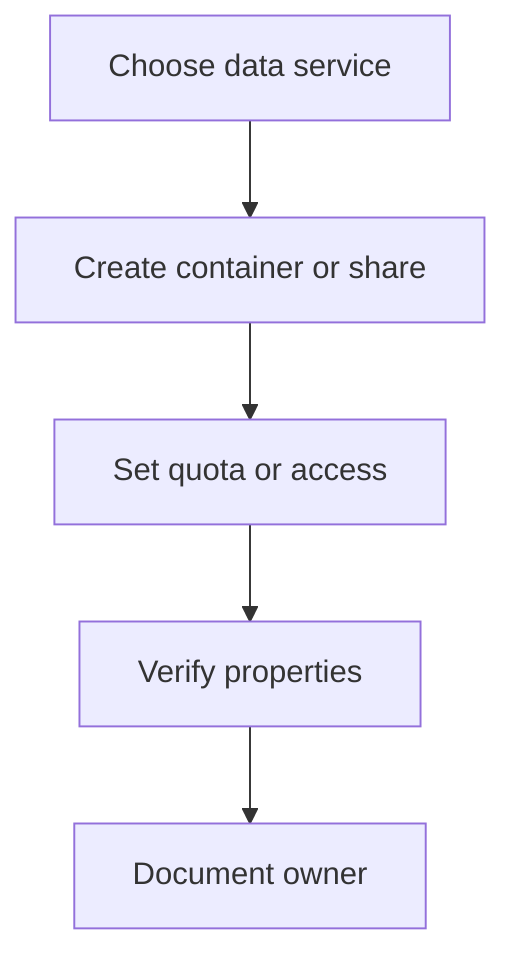

---
content_sources:
  diagrams:
    - id: operations-manage-containers-and-shares
      type: flowchart
      source: mslearn-adapted
      mslearn_url: https://learn.microsoft.com/en-us/azure/storage/blobs/storage-blobs-introduction
content_validation:
  status: verified
  last_reviewed: "2026-05-21"
  reviewer: ai-agent
  core_claims:
    - claim: "Create and review Blob containers and Azure Files shares with clear ownership, access, and retention expectations"
      source: https://learn.microsoft.com/en-us/azure/storage/blobs/storage-blobs-introduction
      verified: true
    - claim: "Storage operations should include verification and rollback guidance before production use"
      source: https://learn.microsoft.com/en-us/azure/storage/blobs/storage-blobs-introduction
      verified: true
---

# Manage Containers and Shares

Create and review Blob containers and Azure Files shares with clear ownership, access, and retention expectations.

<!-- diagram-id: operations-manage-containers-and-shares -->

```mermaid
flowchart TD
    A[Choose data service]
    B[Create container or share]
    A --> B
    C[Set quota or access]
    B --> C
    D[Verify properties]
    C --> D
    E[Document owner]
    D --> E
```

## Prerequisites

- Azure CLI authenticated to the correct tenant and subscription.
- Variables such as `$RG`, `$LOCATION`, `$STORAGE_NAME`, and workload-specific names are set.
- Operator has the control-plane and data-plane roles required for the task.
- A rollback owner is available for changes that affect production access.

## When to Use

- Adding object containers for an application.
- Creating file shares for SMB or NFS workloads.

## Procedure

| Command | Purpose |
|---|---|
| `az storage container create` | Creates a private Blob container. |
| `az storage share-rm create` | Creates an Azure Files share through the resource provider. |

```bash
az storage container create \
    --account-name $STORAGE_NAME \
    --name $CONTAINER_NAME \
    --auth-mode login \
    --public-access off \
    --output json

az storage share-rm create \
    --resource-group $RG \
    --storage-account $STORAGE_NAME \
    --name $SHARE_NAME \
    --quota 1024 \
    --enabled-protocols SMB \
    --output json
```

## Verification

| Command | Purpose |
|---|---|
| `verification command` | Confirms that the intended configuration is active after the procedure. |

```bash
az storage container show \
    --account-name $STORAGE_NAME \
    --name $CONTAINER_NAME \
    --auth-mode login \
    --output json

az storage share-rm show \
    --resource-group $RG \
    --storage-account $STORAGE_NAME \
    --name $SHARE_NAME \
    --output json
```

## Rollback / Troubleshooting

- If access fails, check identity assignment, network rules, and DNS before changing data-plane permissions.
- If a change blocks production traffic, restore the previous firewall or public-network setting only for the approved recovery window.
- Capture command output and Azure Activity Log entries for incident notes.

## See Also

- [Blob Storage Basics](../platform/blob-storage-basics.md)
- [File Storage Basics](../platform/file-storage-basics.md)
- [Blob Best Practices](../best-practices/blob-best-practices.md)

## Sources

- [Microsoft Learn: Manage Containers and Shares](https://learn.microsoft.com/en-us/azure/storage/blobs/storage-blobs-introduction)
