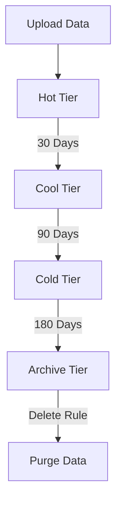

---
hide:
  - toc
content_sources:
  diagrams:
    - id: operations-manage-lifecycle-policies
      type: flowchart
      source: mslearn-adapted
      mslearn_url: https://learn.microsoft.com/en-us/azure/storage/blobs/lifecycle-management-overview
---

# Manage Lifecycle Policies

Automate data transitions based on age and access patterns.

| Action | Target Tier | Typical Rule |
|--------|-------------|--------------|
| Tier to Cool | Cool Tier | Age > 30 days. |
| Tier to Cold | Cold Tier | Age > 90 days. |
| Tier to Archive | Archive Tier | Age > 180 days. |
| Delete | N/A | Age > 2 years. |

!!! note
    Rehydrating data from the Archive tier can take several hours depending on the request priority.

<!-- diagram-id: operations-manage-lifecycle-policies -->

## Policy Validation Checklist

- Target filters by prefix, blob type, and tags.
- Validate rule order and age thresholds.
- Confirm archive rehydration impact for recovery workflows.
- Exclude critical data from destructive rules.
- Review costs after tier transitions and retrieval operations.
- Track policy execution with storage metrics and logs.

## See Also

- [Lifecycle Management Best Practices](../best-practices/lifecycle-management-best-practices.md)
- [Cost Optimization Best Practices](../best-practices/cost-optimization-best-practices.md)
- [Blob Storage Basics](../platform/blob-storage-basics.md)

## Sources
- [Blob lifecycle management](https://learn.microsoft.com/en-us/azure/storage/blobs/lifecycle-management-overview)
- [Configure lifecycle policies](https://learn.microsoft.com/en-us/azure/storage/blobs/lifecycle-management-policy-configure)
