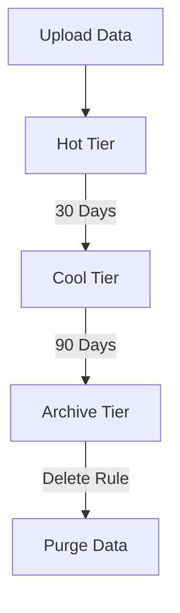

# Manage Lifecycle Policies

Automate data transitions based on age and access patterns.

| Action | Target Tier | Typical Rule |
|--------|-------------|--------------|
| Tier to Cool | Cool Tier | Age > 30 days. |
| Tier to Cold | Cold Tier | Age > 90 days. |
| Tier to Archive | Archive Tier | Age > 180 days. |
| Delete | N/A | Age > 2 years. |

!!! note
    Rehydrating data from the Archive tier can take several hours depending on the request priority.

## Sources
- [Blob lifecycle management](https://learn.microsoft.com/en-us/azure/storage/blobs/lifecycle-management-overview)
- [Configure lifecycle policies](https://learn.microsoft.com/en-us/azure/storage/blobs/lifecycle-management-policy-configure)
