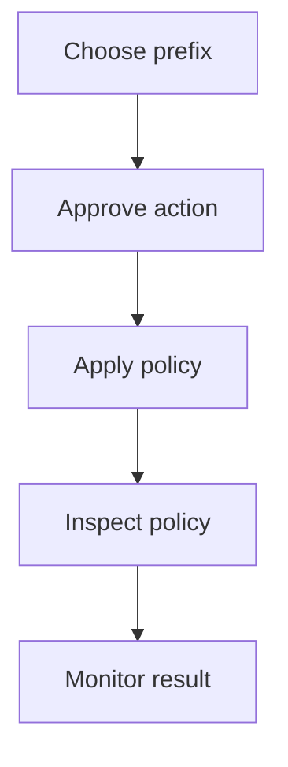

---
content_sources:
  diagrams:
    - id: operations-manage-lifecycle-policies
      type: flowchart
      source: mslearn-adapted
      mslearn_url: https://learn.microsoft.com/en-us/azure/storage/blobs/lifecycle-management-overview
content_validation:
  status: verified
  last_reviewed: "2026-05-21"
  reviewer: ai-agent
  core_claims:
    - claim: "Apply and review Blob lifecycle policies for tiering and retention after data owners approve scope and actions"
      source: https://learn.microsoft.com/en-us/azure/storage/blobs/lifecycle-management-overview
      verified: true
    - claim: "Storage operations should include verification and rollback guidance before production use"
      source: https://learn.microsoft.com/en-us/azure/storage/blobs/lifecycle-management-overview
      verified: true
---

# Manage Lifecycle Policies

Apply and review Blob lifecycle policies for tiering and retention after data owners approve scope and actions.

<!-- diagram-id: operations-manage-lifecycle-policies -->

```mermaid
flowchart TD
    A[Choose prefix]
    B[Approve action]
    A --> B
    C[Apply policy]
    B --> C
    D[Inspect policy]
    C --> D
    E[Monitor result]
    D --> E
```

## Prerequisites

- Azure CLI authenticated to the correct tenant and subscription.
- Variables such as `$RG`, `$LOCATION`, `$STORAGE_NAME`, and workload-specific names are set.
- Operator has the control-plane and data-plane roles required for the task.
- A rollback owner is available for changes that affect production access.

## When to Use

- Moving old blobs to Cool, Cold, or Archive.
- Deleting temporary data after an approved retention period.

## Procedure

| Command | Purpose |
|---|---|
| `az storage account management-policy create` | Creates or replaces the lifecycle policy. |
| `az storage account management-policy show` | Displays the active lifecycle policy. |

```bash
az storage account management-policy create \
    --resource-group $RG \
    --account-name $STORAGE_NAME \
    --policy '{"rules":[{"enabled":true,"name":"tier-logs","type":"Lifecycle","definition":{"actions":{"baseBlob":{"tierToCool":{"daysAfterModificationGreaterThan":30}}},"filters":{"blobTypes":["blockBlob"],"prefixMatch":["logs/"]}}}]}' \
    --output json

az storage account management-policy show \
    --resource-group $RG \
    --account-name $STORAGE_NAME \
    --output json
```

## Verification

| Command | Purpose |
|---|---|
| `verification command` | Confirms that the intended configuration is active after the procedure. |

```bash
az storage account management-policy show \
    --resource-group $RG \
    --account-name $STORAGE_NAME \
    --query "policy.rules[].{name:name,enabled:enabled,type:type}" \
    --output table
```

## Rollback / Troubleshooting

- If access fails, check identity assignment, network rules, and DNS before changing data-plane permissions.
- If a change blocks production traffic, restore the previous firewall or public-network setting only for the approved recovery window.
- Capture command output and Azure Activity Log entries for incident notes.

## See Also

- [Lifecycle Management Best Practices](../best-practices/lifecycle-management-best-practices.md)
- [Cost Optimization Best Practices](../best-practices/cost-optimization-best-practices.md)
- [Lifecycle Policy Not Working](../troubleshooting/playbooks/lifecycle-policy-not-working.md)

## Sources

- [Microsoft Learn: Manage Lifecycle Policies](https://learn.microsoft.com/en-us/azure/storage/blobs/lifecycle-management-overview)
