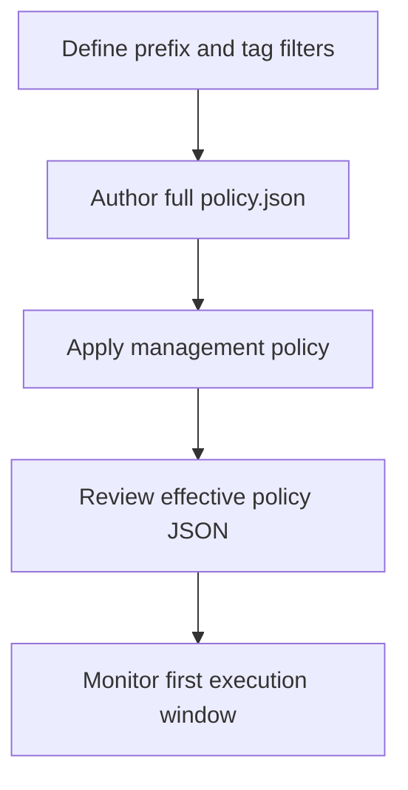

# Manage Lifecycle Policies

Use this runbook to automate tiering and deletion for blob data without turning retention management into an unreviewed cost or recovery risk.

## Prerequisites

- A GPv2, Blob Storage, or premium block blob account that supports lifecycle management.
- Storage account name in `$STG`, resource group in `$RG`, and a reviewed `policy.json` file.
- Approval from the workload owner for any destructive delete action.
- Soft-delete or versioning posture reviewed before enabling delete rules.

## When to Use

- Moving inactive blobs to cool, cold, or archive tiers.
- Expiring old versions, snapshots, or backup artifacts after retention windows.
- Correcting manual tiering drift with a policy that is easier to audit.

## Procedure

Author the full policy document first, validate the filters carefully, then apply it as one account-level management policy.

<!-- diagram-id: operations-manage-lifecycle-policies -->

```mermaid
flowchart TD
    A[Define prefix and tag filters] --> B[Author full policy.json]
    B --> C[Apply management policy]
    C --> D[Review effective policy JSON]
    D --> E[Monitor first execution window]
```

```json
{
  "rules": [
    {
      "enabled": true,
      "name": "archive-logs",
      "type": "Lifecycle",
      "definition": {
        "filters": {
          "blobTypes": ["blockBlob"],
          "prefixMatch": ["logs/", "archive/"]
        },
        "actions": {
          "baseBlob": {
            "tierToCool": { "daysAfterModificationGreaterThan": 30 },
            "tierToArchive": { "daysAfterModificationGreaterThan": 180 },
            "delete": { "daysAfterModificationGreaterThan": 730 }
          }
        }
      }
    }
  ]
}
```

```bash
az storage account management-policy create \
  --account-name $STG \
  --resource-group $RG \
  --policy @policy.json && \
az storage account management-policy show \
  --account-name $STG \
  --resource-group $RG \
  --output json
```
| Command | Purpose |
| --- | --- |
| `az storage account management-policy create` | Apply the lifecycle policy JSON to the storage account. |
| `--account-name` | Specify the storage account that will receive the policy. |
| `--resource-group` | Scope the management policy operation to the correct resource group. |
| `--policy` | Provide the full JSON document because partial updates are not supported. |
| `az storage account management-policy show` | Retrieve the effective policy after creation. |
| `--output` | Emit JSON evidence for review and version control. |

Expected result:

- The command succeeds without schema errors.
- The returned JSON matches the reviewed filters and day thresholds.
- No production container is affected outside the `logs/` and `archive/` prefixes.

## Verification

- Compare the returned JSON with the submitted `policy.json` and confirm no drift.
- Expect up to 24 hours before the first execution begins.
- For destructive policies, sample a few blobs under the targeted prefixes and verify their last modified times and business retention requirements before waiting for the first run.

## Rollback / Troubleshooting

- If the wrong prefixes were targeted, replace the policy immediately with a corrected full JSON document.
- If the delete threshold is too aggressive, remove the delete action or raise the day value and reapply the full document.
- If the policy must be paused, disable the rule in JSON and reapply; then wait for the current run window to settle.
- If no action appears after the waiting period, verify the targeted objects are block blobs and that filters actually match the intended paths or tags.

## See Also

- [Backup and Data Protection](backup-and-data-protection.md)
- [Cost Optimization Best Practices](../best-practices/cost-optimization-best-practices.md)
- [Blob Storage Basics](../platform/blob-storage-basics.md)

## Sources

- [Azure Blob Storage lifecycle management overview](https://learn.microsoft.com/en-us/azure/storage/blobs/lifecycle-management-overview)
- [Configure a lifecycle management policy](https://learn.microsoft.com/en-us/azure/storage/blobs/lifecycle-management-policy-configure)
