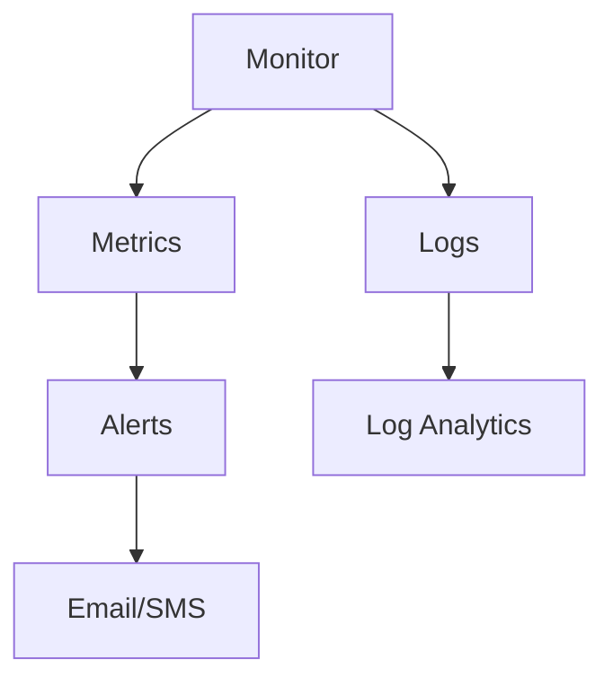

# Monitoring and Alerting

Track storage health, performance, and availability metrics.

| Metric | Category | Description |
|--------|----------|-------------|
| Availability | Health | Percentage of successful requests. |
| Latency | Performance | Time taken to process requests. |
| Transactions | Load | Number of storage operations. |
| Egress/Ingress | Data | Volume of data moved in/out. |
| Capacity | Usage | Total used storage space. |

!!! tip
    Set alerts on "Availability < 99%" and "E2E Latency > Threshold" for early incident detection.

## Sources
- [Monitoring Azure Storage](https://learn.microsoft.com/en-us/azure/storage/common/storage-monitoring-overview)
- [Diagnostic logging](https://learn.microsoft.com/en-us/azure/storage/common/storage-analytics-logging)
