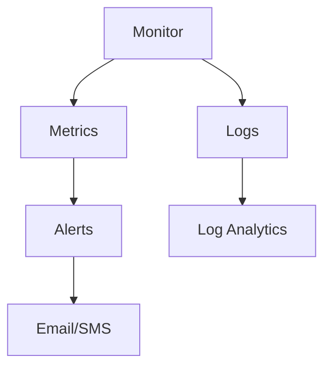

---
hide:
  - toc
content_sources:
  diagrams:
    - id: operations-monitoring-and-alerting
      type: flowchart
      source: mslearn-adapted
      mslearn_url: https://learn.microsoft.com/en-us/azure/storage/blobs/monitor-blob-storage
---

# Monitoring and Alerting

Track storage health, performance, and availability metrics.

| Metric | Category | Description |
|--------|----------|-------------|
| Availability | Health | Percentage of successful requests. |
| Latency | Performance | Time taken to process requests. |
| Transactions | Load | Number of storage operations. |
| Egress/Ingress | Data | Volume of data moved in/out. |
| Capacity | Usage | Total used storage space. |

!!! tip
    Set alerts on "Availability < 99%" and "E2E Latency > Threshold" for early incident detection.

<!-- diagram-id: operations-monitoring-and-alerting -->

## Monitoring Checklist

- Define baseline thresholds for latency and availability.
- Configure metric alerts for 429, 503, and latency spikes.
- Route alerts to on-call channels and ticketing systems.
- Enable diagnostics for blob, file, queue, and table services.
- Retain logs long enough for incident and trend analysis.
- Review capacity and transaction growth monthly.

## See Also

- [Performance Best Practices](../best-practices/performance-best-practices.md)
- [Throttling and Performance Issues](../troubleshooting/playbooks/performance/throttling-and-performance-issues.md)
- [Backup and Data Protection](backup-and-data-protection.md)

## Sources
- [Monitoring Azure Blob Storage](https://learn.microsoft.com/en-us/azure/storage/blobs/monitor-blob-storage)
- [Diagnostic logging](https://learn.microsoft.com/en-us/azure/storage/common/storage-analytics-logging)
