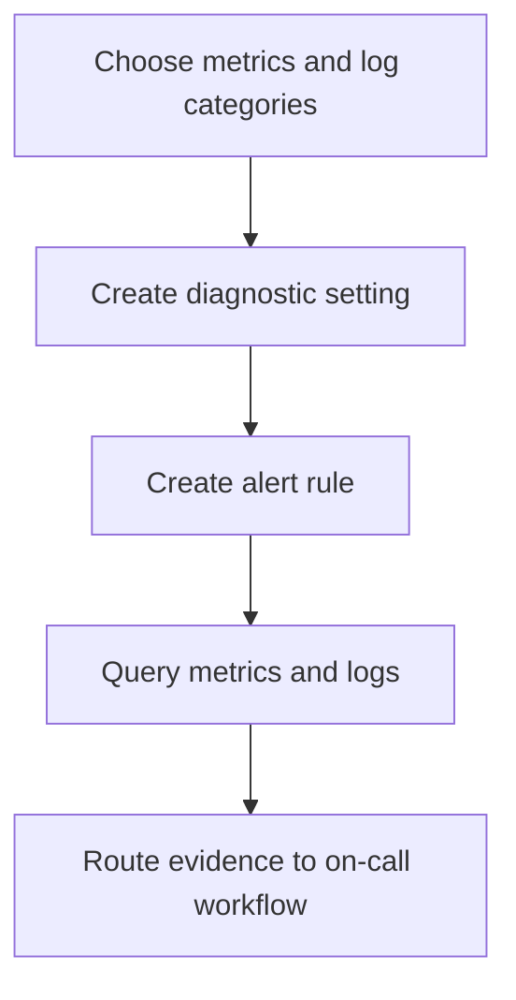

# Monitoring and Alerting

Use this runbook to turn raw storage metrics and request logs into operational evidence and alerts that an on-call engineer can actually act on.

## Prerequisites

- Storage account `$STG`, resource group `$RG`, and a Log Analytics workspace resource ID in `$LAW_ID`.
- Permission to create diagnostic settings and Azure Monitor alerts.
- Agreed alert routing, such as an action group, before you create production alerts.

## When to Use

- Bringing a new storage account into production support.
- Replacing portal-only monitoring with durable logs and alerts.
- Investigating repeated latency, throttling, or availability incidents.

## Procedure

Enable log routing first so investigations have data, then add alerts that match the storage behavior you actually care about.

<!-- diagram-id: operations-monitoring-and-alerting -->

```mermaid
flowchart TD
    A[Choose metrics and log categories] --> B[Create diagnostic setting]
    B --> C[Create alert rule]
    C --> D[Query metrics and logs]
    D --> E[Route evidence to on-call workflow]
```

```bash
STG_ID=$(az storage account show --name $STG --resource-group $RG --query id --output tsv) && \
az monitor diagnostic-settings create \
  --name storage-to-law \
  --resource $STG_ID \
  --workspace $LAW_ID \
  --logs '[{"category":"StorageRead","enabled":true},{"category":"StorageWrite","enabled":true},{"category":"StorageDelete","enabled":true}]' \
  --metrics '[{"category":"Transaction","enabled":true}]' && \
az monitor metrics alert create \
  --name storage-availability-low \
  --resource-group $RG \
  --scopes $STG_ID \
  --condition "avg Availability < 99" \
  --description "Alert when storage availability drops below 99 percent" \
  --window-size 5m \
  --evaluation-frequency 5m \
  --severity 2
```
| Command | Purpose |
| --- | --- |
| `az storage account show` | Retrieve the storage account resource ID needed by Azure Monitor commands. |
| `--name` | Specify the storage account or alert resource name. |
| `--resource-group` | Scope the storage or alert resource to the correct resource group. |
| `--query` | Return the storage account resource ID only. |
| `--output` | Emit the resource ID as plain text for reuse. |
| `az monitor diagnostic-settings create` | Route logs and metrics from the storage account to the monitoring destination. |
| `--resource` | Identify the storage account whose diagnostics will be exported. |
| `--workspace` | Choose the Log Analytics workspace destination. |
| `--logs` | Enable the storage log categories needed for investigations. |
| `--metrics` | Route selected metrics for richer analytics or retention. |
| `az monitor metrics alert create` | Create an actionable metric alert. |
| `--scopes` | Bind the alert to the storage account resource ID. |
| `--condition` | Define the threshold that should trigger an alert. |
| `--description` | Document the alert intent for responders. |
| `--window-size` | Set the aggregation period for evaluation. |
| `--evaluation-frequency` | Decide how often Azure Monitor reevaluates the condition. |
| `--severity` | Set the incident urgency level. |

Expected result:

- The diagnostic setting is created and points to the Log Analytics workspace.
- The metric alert exists and evaluates the `Availability` metric.
- Future read, write, and delete operations can be queried from the workspace after ingestion delay.

## Verification

```bash
az monitor diagnostic-settings list \
  --resource $STG_ID \
  --output table && \
az monitor metrics list \
  --resource $STG_ID \
  --metric Availability \
  --interval PT1H \
  --output table
```
| Command | Purpose |
| --- | --- |
| `az monitor diagnostic-settings list` | Confirm the storage account has the expected diagnostic setting. |
| `--resource` | Specify the resource whose diagnostic settings will be listed. |
| `--output` | Render the diagnostic settings in a reviewable table. |
| `az monitor metrics list` | Confirm the `Availability` metric is queryable. |
| `--metric` | Select the metric to validate. |
| `--interval` | Choose the metrics aggregation interval for the evidence query. |

Healthy evidence shows the diagnostic setting in place and returns metric data for `Availability`. In Log Analytics, you should also see storage log tables populate after requests hit the account.

## Rollback / Troubleshooting

- If logs do not arrive, verify the workspace resource ID and confirm the storage account is generating traffic.
- If alert noise is too high, tune the threshold or add an action group and escalation path instead of deleting monitoring entirely.
- If you accidentally targeted the same storage account as both source and log destination, remove that diagnostic setting and recreate it against a different destination.
- If file-share incidents need deeper visibility, add Azure Files monitoring queries and metrics alongside the blob-focused baseline.

## See Also

- [Backup and Data Protection](backup-and-data-protection.md)
- [Throttling and Performance Issues](../troubleshooting/playbooks/performance/throttling-and-performance-issues.md)
- [Performance Best Practices](../best-practices/performance-best-practices.md)

## Sources

- [Monitor Azure Blob Storage](https://learn.microsoft.com/en-us/azure/storage/blobs/monitor-blob-storage)
- [Monitoring data reference for Azure Files](https://learn.microsoft.com/en-us/azure/storage/files/storage-files-monitoring-reference)
