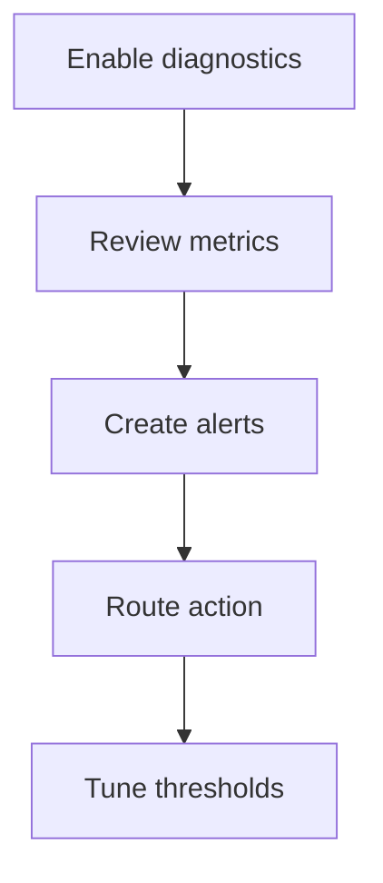

---
content_sources:
  diagrams:
    - id: operations-monitoring-and-alerting
      type: flowchart
      source: mslearn-adapted
      mslearn_url: https://learn.microsoft.com/en-us/azure/storage/common/monitor-storage
content_validation:
  status: verified
  last_reviewed: "2026-05-21"
  reviewer: ai-agent
  core_claims:
    - claim: "Collect Storage metrics and logs so incidents can distinguish authorization, network, latency, and throttling failures"
      source: https://learn.microsoft.com/en-us/azure/storage/common/monitor-storage
      verified: true
    - claim: "Storage operations should include verification and rollback guidance before production use"
      source: https://learn.microsoft.com/en-us/azure/storage/common/monitor-storage
      verified: true
---

# Monitoring and Alerting

Collect Storage metrics and logs so incidents can distinguish authorization, network, latency, and throttling failures.

<!-- diagram-id: operations-monitoring-and-alerting -->

```mermaid
flowchart TD
    A[Enable diagnostics]
    B[Review metrics]
    A --> B
    C[Create alerts]
    B --> C
    D[Route action]
    C --> D
    E[Tune thresholds]
    D --> E
```

## Prerequisites

- Azure CLI authenticated to the correct tenant and subscription.
- Variables such as `$RG`, `$LOCATION`, `$STORAGE_NAME`, and workload-specific names are set.
- Operator has the control-plane and data-plane roles required for the task.
- A rollback owner is available for changes that affect production access.

## When to Use

- Preparing a production storage account for support.
- Investigating latency, availability, or transaction anomalies.

## Procedure

| Command | Purpose |
|---|---|
| `az monitor diagnostic-settings create` | Sends Storage logs and metrics to Log Analytics. |
| `az monitor metrics list` | Queries recent Storage metrics. |

```bash
az monitor diagnostic-settings create \
    --name storage-diagnostics \
    --resource $(az storage account show --resource-group $RG --name $STORAGE_NAME --query id --output tsv) \
    --workspace $WORKSPACE_ID \
    --logs '[{"categoryGroup":"audit","enabled":true}]' \
    --metrics '[{"category":"Transaction","enabled":true}]' \
    --output json

az monitor metrics list \
    --resource $(az storage account show --resource-group $RG --name $STORAGE_NAME --query id --output tsv) \
    --metric Availability,SuccessE2ELatency,Transactions \
    --interval PT1M \
    --output json
```

## Verification

| Command | Purpose |
|---|---|
| `verification command` | Confirms that the intended configuration is active after the procedure. |

```bash
az monitor diagnostic-settings list \
    --resource $(az storage account show --resource-group $RG --name $STORAGE_NAME --query id --output tsv) \
    --output json
```

## Rollback / Troubleshooting

- If access fails, check identity assignment, network rules, and DNS before changing data-plane permissions.
- If a change blocks production traffic, restore the previous firewall or public-network setting only for the approved recovery window.
- Capture command output and Azure Activity Log entries for incident notes.

## See Also

- [Performance Best Practices](../best-practices/performance-best-practices.md)
- [Storage Throttling](../troubleshooting/playbooks/storage-throttling.md)
- [Performance Terms](../reference/performance-terms.md)

## Sources

- [Microsoft Learn: Monitoring and Alerting](https://learn.microsoft.com/en-us/azure/storage/common/monitor-storage)
