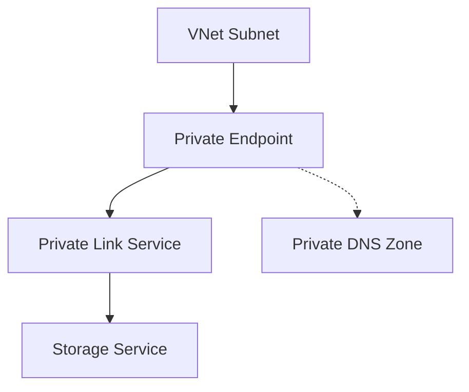

# Use Private Endpoints

Enable private connectivity to your storage account via Azure Private Link.

| Step | Action | Verification |
|------|--------|--------------|
| 1 | Create Private Endpoint | PE object exists in subnet. |
| 2 | Create Private DNS Zone | Zone matches service type. |
| 3 | Link DNS Zone | Zone linked to client VNet. |
| 4 | Verify DNS | nslookup returns private IP. |
| 5 | Disable Public Access | Test via external network. |

!!! warning
    Verify private DNS resolution is fully operational before disabling public network access.

## Sources
- [Private Endpoints for storage](https://learn.microsoft.com/en-us/azure/storage/common/storage-private-endpoints)
- [Configure Private Link DNS](https://learn.microsoft.com/en-us/azure/private-link/private-endpoint-dns)
