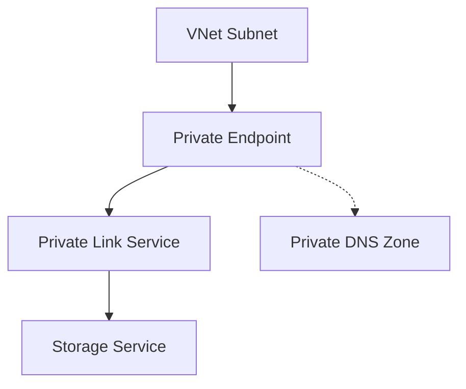

---
hide:
  - toc
---

# Use Private Endpoints

Enable private connectivity to your storage account via Azure Private Link.

| Step | Action | Verification |
|------|--------|--------------|
| 1 | Create Private Endpoint | PE object exists in subnet. |
| 2 | Create Private DNS Zone | Zone matches service type. |
| 3 | Link DNS Zone | Zone linked to client VNet. |
| 4 | Verify DNS | nslookup returns private IP. |
| 5 | Disable Public Access | Test via external network. |

!!! warning
    Verify private DNS resolution is fully operational before disabling public network access.

    Creating a private endpoint does not deny public traffic by itself. Validate DNS first, then disable public network access or apply firewall rules to complete the isolation.

## Deployment Checklist

- Place endpoint in a subnet with required NSG rules.
- Create service-specific private DNS zones.
- For HNS-enabled (Data Lake Gen2) accounts, create private endpoints for both blob and dfs sub-resources.
- Link zones to all client VNets that resolve names.
- Validate forwarders for hybrid DNS environments.
- Test connectivity before disabling public endpoint access.
- Validate endpoint approval status and NIC IP assignment.

## See Also

- [Networking and Private Access](../platform/networking-and-private-access.md)
- [Networking Best Practices](../best-practices/networking-best-practices.md)
- [Private Endpoint and DNS Issues](../troubleshooting/playbooks/access/private-endpoint-and-dns-issues.md)

## Sources
- [Private Endpoints for storage](https://learn.microsoft.com/en-us/azure/storage/common/storage-private-endpoints)
- [Configure Private Link DNS](https://learn.microsoft.com/en-us/azure/private-link/private-endpoint-dns)
