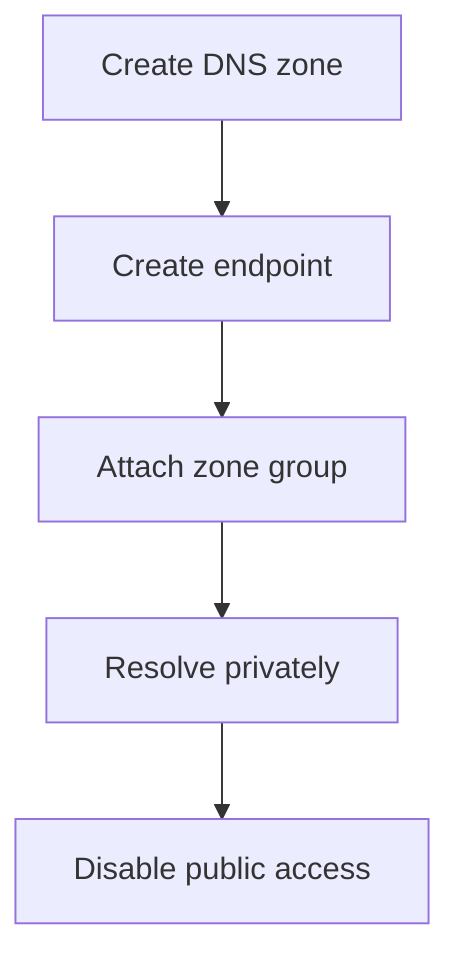

---
content_sources:
  diagrams:
    - id: operations-use-private-endpoints
      type: flowchart
      source: mslearn-adapted
      mslearn_url: https://learn.microsoft.com/en-us/azure/storage/common/storage-private-endpoints
content_validation:
  status: verified
  last_reviewed: "2026-05-21"
  reviewer: ai-agent
  core_claims:
    - claim: "Deploy Private Endpoint connectivity for Storage and validate DNS before disabling public access"
      source: https://learn.microsoft.com/en-us/azure/storage/common/storage-private-endpoints
      verified: true
    - claim: "Storage operations should include verification and rollback guidance before production use"
      source: https://learn.microsoft.com/en-us/azure/storage/common/storage-private-endpoints
      verified: true
---

# Use Private Endpoints

Deploy Private Endpoint connectivity for Storage and validate DNS before disabling public access.

<!-- diagram-id: operations-use-private-endpoints -->

```mermaid
flowchart TD
    A[Create DNS zone]
    B[Create endpoint]
    A --> B
    C[Attach zone group]
    B --> C
    D[Resolve privately]
    C --> D
    E[Disable public access]
    D --> E
```

## Prerequisites

- Azure CLI authenticated to the correct tenant and subscription.
- Variables such as `$RG`, `$LOCATION`, `$STORAGE_NAME`, and workload-specific names are set.
- Operator has the control-plane and data-plane roles required for the task.
- A rollback owner is available for changes that affect production access.

## When to Use

- Applications must reach Storage over private IP addresses.
- Public endpoint access must be removed or tightly restricted.

## Procedure

| Command | Purpose |
|---|---|
| `az network private-dns zone create` | Creates the service-specific private DNS zone. |
| `az network private-endpoint create` | Creates a private endpoint for the storage subresource. |
| `az network private-endpoint dns-zone-group create` | Associates the endpoint with the private DNS zone. |

```bash
az network private-dns zone create \
    --resource-group $RG \
    --name privatelink.blob.core.windows.net \
    --output json

az network private-endpoint create \
    --resource-group $RG \
    --name $PRIVATE_ENDPOINT_NAME \
    --vnet-name $VNET_NAME \
    --subnet $SUBNET_NAME \
    --private-connection-resource-id $(az storage account show --resource-group $RG --name $STORAGE_NAME --query id --output tsv) \
    --group-id blob \
    --connection-name storage-blob-connection \
    --output json

az network private-endpoint dns-zone-group create \
    --resource-group $RG \
    --endpoint-name $PRIVATE_ENDPOINT_NAME \
    --name default \
    --private-dns-zone privatelink.blob.core.windows.net \
    --zone-name privatelink.blob.core.windows.net \
    --output json
```

## Verification

| Command | Purpose |
|---|---|
| `verification command` | Confirms that the intended configuration is active after the procedure. |

```bash
az network private-endpoint show \
    --resource-group $RG \
    --name $PRIVATE_ENDPOINT_NAME \
    --query "{state:provisioningState,connections:privateLinkServiceConnections[].privateLinkServiceConnectionState.status}" \
    --output json
```

## Rollback / Troubleshooting

- If access fails, check identity assignment, network rules, and DNS before changing data-plane permissions.
- If a change blocks production traffic, restore the previous firewall or public-network setting only for the approved recovery window.
- Capture command output and Azure Activity Log entries for incident notes.

## See Also

- [Networking And Private Access](../platform/networking-and-private-access.md)
- [Networking Best Practices](../best-practices/networking-best-practices.md)
- [Private Endpoint And Dns Issues](../troubleshooting/playbooks/access/private-endpoint-and-dns-issues.md)

## Sources

- [Microsoft Learn: Use Private Endpoints](https://learn.microsoft.com/en-us/azure/storage/common/storage-private-endpoints)
