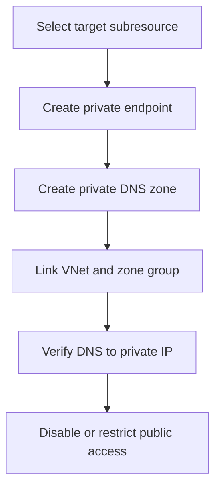

# Use Private Endpoints

Use this runbook when the workload must reach Azure Storage over private IP space instead of the public endpoint.

## Prerequisites

- Storage account `$STG`, resource group `$RG`, virtual network `$VNET`, subnet `$SUBNET`, and private endpoint name `$PE_NAME`.
- Permission to create private endpoints, private DNS zones, and virtual network links.
- A DNS plan that covers all client VNets and any on-premises resolvers.
- For Data Lake Storage Gen2, a decision on whether the workload needs both `blob` and `dfs` subresources.

## When to Use

- Moving a storage workload off the public internet.
- Enforcing east-west private connectivity from VNets, ExpressRoute, or VPN-connected sites.
- Preparing to disable public network access without breaking name resolution.

## Procedure

Build the endpoint and DNS plumbing first, verify name resolution, and only then restrict the public path.

<!-- diagram-id: operations-use-private-endpoints -->

```mermaid
flowchart TD
    A[Select target subresource] --> B[Create private endpoint]
    B --> C[Create private DNS zone]
    C --> D[Link VNet and zone group]
    D --> E[Verify DNS to private IP]
    E --> F[Disable or restrict public access]
```

```bash
STG_ID=$(az storage account show --name $STG --resource-group $RG --query id --output tsv) && \
az network private-endpoint create \
  --name $PE_NAME \
  --resource-group $RG \
  --vnet-name $VNET \
  --subnet $SUBNET \
  --private-connection-resource-id $STG_ID \
  --group-ids blob \
  --connection-name "$PE_NAME-conn" && \
az network private-dns zone create \
  --resource-group $RG \
  --name privatelink.blob.core.windows.net && \
az network private-dns link vnet create \
  --resource-group $RG \
  --zone-name privatelink.blob.core.windows.net \
  --name "$VNET-blob-link" \
  --virtual-network $VNET \
  --registration-enabled false && \
az network private-endpoint dns-zone-group create \
  --resource-group $RG \
  --endpoint-name $PE_NAME \
  --name default \
  --private-dns-zone privatelink.blob.core.windows.net \
  --zone-name privatelink.blob.core.windows.net
```
| Command | Purpose |
| --- | --- |
| `az storage account show` | Retrieve the storage account resource ID used by the private endpoint. |
| `--name` | Specify the storage account or other named resource used by each command. |
| `--resource-group` | Scope the storage, networking, and DNS resources to the intended resource group. |
| `--query` | Return only the storage account resource ID. |
| `--output` | Emit the resource ID as plain text for command chaining. |
| `az network private-endpoint create` | Create the private endpoint NIC and connection. |
| `--vnet-name` | Place the private endpoint in the correct virtual network. |
| `--subnet` | Place the private endpoint in the target subnet. |
| `--private-connection-resource-id` | Identify the storage account that will receive the private connection. |
| `--group-ids` | Select the storage subresource, such as `blob`, `dfs`, `file`, `queue`, or `table`. |
| `--connection-name` | Name the connection object shown on the storage account. |
| `az network private-dns zone create` | Create the private DNS zone for the selected subresource. |
| `az network private-dns link vnet create` | Link the DNS zone to the client virtual network. |
| `--zone-name` | Specify the DNS zone being linked or attached. |
| `--virtual-network` | Choose the VNet that must resolve the storage account to the private IP. |
| `--registration-enabled` | Keep automatic DNS registration disabled for this link. |
| `az network private-endpoint dns-zone-group create` | Associate the private endpoint with the private DNS zone. |
| `--endpoint-name` | Specify the private endpoint that will use the DNS zone group. |
| `--private-dns-zone` | Attach the correct private DNS zone resource. |

Expected result:

- The private endpoint is created and approved.
- The `privatelink.blob.core.windows.net` zone exists and is linked to the VNet.
- Name resolution inside the VNet can now return the private IP for the storage account endpoint.

## Verification

```bash
az network private-endpoint show \
  --name $PE_NAME \
  --resource-group $RG \
  --query "{status:customDnsConfigs[0].fqdn,privateIp:customDnsConfigs[0].ipAddresses[0],connectionState:privateLinkServiceConnections[0].privateLinkServiceConnectionState.status}" \
  --output table
```
| Command | Purpose |
| --- | --- |
| `az network private-endpoint show` | Confirm the endpoint IP and approval state. |
| `--name` | Specify the private endpoint to inspect. |
| `--resource-group` | Scope the lookup to the correct resource group. |
| `--query` | Return the private FQDN, IP address, and connection state only. |
| `--output` | Render a concise verification table. |

Healthy evidence shows an `Approved` connection state and a private IP in the client subnet address space. From a VM in the linked VNet, `nslookup $STG.blob.core.windows.net` should resolve to that private IP.

## Rollback / Troubleshooting

- If DNS still resolves to the public endpoint, verify the VNet link, the DNS zone group, and any custom or on-premises DNS forwarders.
- If Data Lake operations fail while blob works, add a second private endpoint or zone path for the `dfs` subresource.
- If clients lose connectivity after public access is disabled, re-enable public access temporarily with `az storage account update --name $STG --resource-group $RG --public-network-access Enabled` while fixing DNS.
- If the private endpoint must be removed, delete the DNS zone group first, then the private endpoint, and finally any unused private DNS zones or links.

## See Also

- [Configure Network Rules](configure-network-rules.md)
- [Private Endpoint and DNS Issues](../troubleshooting/playbooks/access/private-endpoint-and-dns-issues.md)
- [Networking and Private Access](../platform/networking-and-private-access.md)

## Sources

- [Use private endpoints for Azure Storage](https://learn.microsoft.com/en-us/azure/storage/common/storage-private-endpoints)
- [Azure Private Endpoint private DNS zone values](https://learn.microsoft.com/en-us/azure/private-link/private-endpoint-dns)
