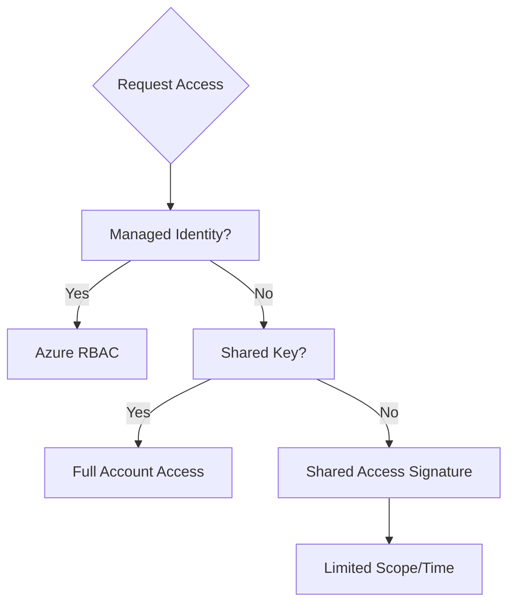

---
content_sources:
  diagrams:
    - id: platform-access-models
      type: flowchart
      source: mslearn-adapted
      mslearn_url: https://learn.microsoft.com/en-us/azure/storage/common/storage-auth
---

# Access Models

Azure Storage provides several options for authenticating and authorizing access to your data resources.

| Method | Scope | Expiration | Security Level | Use Case |
| :--- | :--- | :--- | :--- | :--- |
| **Shared Key** | Account level | No | Low | Simple apps, legacy systems. |
| **SAS** | Varies by SAS type (blob/container/share/queue/table/account) | Custom | Medium | Granting limited-time access. |
| **RBAC** | Resource level | N/A | High | Identity-based permissioning. |
| **Managed ID** | Identity level | Dynamic | Highest | Secure service-to-service auth. |

<!-- diagram-id: platform-access-models -->

!!! warning
    Minimize the use of Shared Keys. If a key is compromised, the attacker has full access to the entire storage account. Prefer Azure AD (RBAC) and Managed Identities where possible.

## Auth Options
- **Azure AD (Entra ID)**: Best for fine-grained, identity-based control.
- **Shared Access Signature (SAS)**: Best for giving third parties limited access.
- **Storage Account Keys**: Root access, used as a last resort.

## See Also

- [Security Best Practices](../best-practices/security-best-practices.md)
- [Configure Access and Identity](../operations/configure-access-and-identity.md)
- [Access Methods Cheatsheet](../reference/access-methods-cheatsheet.md)

## Sources
- [Authorize access to Azure Storage](https://learn.microsoft.com/en-us/azure/storage/common/storage-auth)
- [Grant limited access using SAS](https://learn.microsoft.com/en-us/azure/storage/common/storage-sas-overview)
