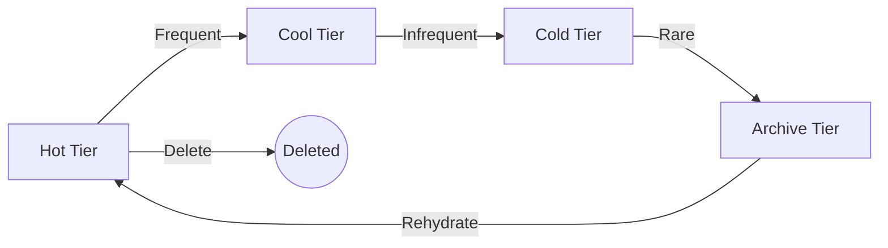

---
hide:
  - toc
---

# Blob Storage Basics

Blob Storage is Azure's object storage solution for the cloud, optimized for storing massive amounts of unstructured data.

| Tier | Availability | Cost (Storage) | Cost (Access) | Retention |
| :--- | :--- | :--- | :--- | :--- |
| **Hot** | Highest | Highest | Lowest | None |
| **Cool** | High | Low | High | 30 days |
| **Cold** | Medium | Lower | Higher | 90 days |
| **Archive** | Lowest | Lowest | Highest | 180 days |

## Storage Concepts
- **Containers**: Groups of blobs, similar to a directory in a file system.
- **Blobs**: Individual data objects (Block, Page, or Append).
- **Metadata**: Key-value pairs associated with a blob or container.

## Data Types
- **Block Blobs**: Best for documents, images, and videos.
- **Append Blobs**: Optimized for logging operations.
- **Page Blobs**: Designed for frequent random read/write operations (e.g., VHDs).

!!! tip
    Define access tiers and lifecycle policies together so data moves predictably between Hot, Cool, Cold, and Archive based on age and access frequency.

## See Also

- [Blob Best Practices](../best-practices/blob-best-practices.md)
- [Manage Containers and Shares](../operations/manage-containers-and-shares.md)
- [Access Models](access-models.md)

## Sources
- [Introduction to Azure Blob Storage](https://learn.microsoft.com/en-us/azure/storage/blobs/storage-blobs-introduction)
- [Access tiers for blob data](https://learn.microsoft.com/en-us/azure/storage/blobs/access-tiers-overview)
