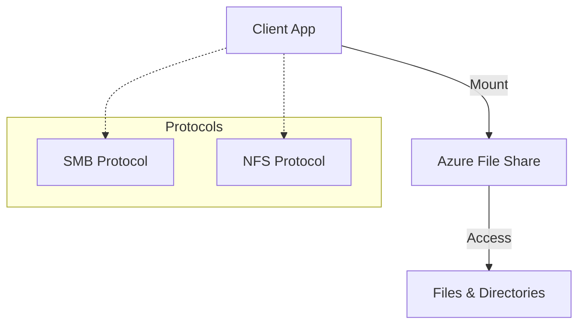

# File Storage Basics

Azure Files offers fully managed file shares in the cloud that are accessible via the industry standard Server Message Block (SMB) and Network File System (NFS) protocols.

| Feature | SMB | NFS |
| :--- | :--- | :--- |
| **Protocol** | SMB 2.1/3.0/3.1.1 | NFS 4.1 |
| **Auth** | AD DS, Azure AD DS, Kerberos | IP-based allow lists |
| **OS Support** | Windows, Linux, macOS | Linux only |
| **Use Case** | Traditional Windows apps | High-performance Linux apps |

!!! note
    Premium file shares are recommended for I/O-intensive workloads, while Standard shares are cost-effective for general-purpose file sharing and backups.

## Key Benefits
- **Shared Access**: Mount simultaneously from cloud or on-premises.
- **Fully Managed**: No hardware or OS maintenance required.
- **Data Resilience**: Built on the durable Azure Storage platform.

## See Also

- [File Share Best Practices](../best-practices/file-share-best-practices.md)
- [Manage Containers and Shares](../operations/manage-containers-and-shares.md)
- [File Share Mount Issues](../troubleshooting/file-share-mount-issues.md)

## Sources
- [What is Azure Files?](https://learn.microsoft.com/en-us/azure/storage/files/storage-files-introduction)
- [Azure Files performance tiers](https://learn.microsoft.com/en-us/azure/storage/files/storage-files-planning#performance-tiers)
