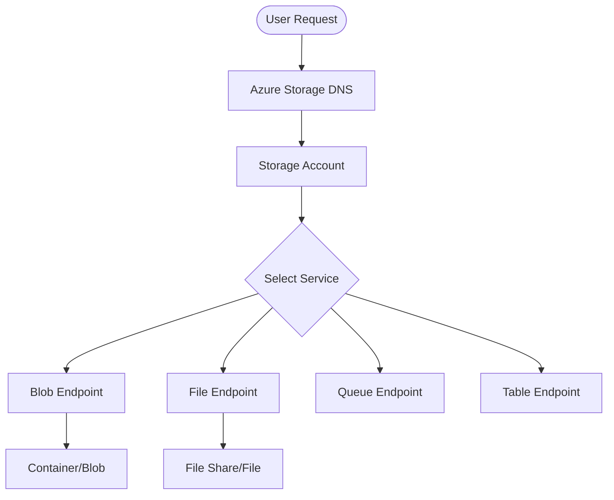

---
content_sources:
  diagrams:
    - id: platform-how-azure-storage-works
      type: flowchart
      source: mslearn-adapted
      mslearn_url: https://learn.microsoft.com/en-us/azure/storage/common/storage-introduction
---

# How Azure Storage Works

Azure Storage provides a scalable, distributed storage platform for diverse data types, managed through specialized control and data planes.

| Operation Type | Description | Key Services | Impact |
| :--- | :--- | :--- | :--- |
| **Control Plane** | Managing storage accounts and resources. | Azure Resource Manager (ARM) | Affects configuration, not data content. |
| **Data Plane** | Interacting with stored data objects. | REST APIs, Client SDKs, Storage Explorer | Directly reads or writes data content. |

<!-- diagram-id: platform-how-azure-storage-works -->

!!! note
    Storage endpoint DNS names typically follow the pattern `<account-name>.<service>.core.windows.net`. For example, `mystorage.blob.core.windows.net` for blob storage access.

## Architecture Highlights
- **Storage Account**: The top-level resource and administrative container for all data.
- **Regions**: Physical locations where data is stored to meet compliance and performance needs.
- **Redundancy**: Multiple copies of data maintained to ensure durability and availability.

## See Also

- [Storage Account Basics](storage-account-basics.md)
- [Redundancy and Durability](redundancy-and-durability.md)
- [Access Models](access-models.md)

## Sources
- [Azure Storage architectural overview](https://learn.microsoft.com/en-us/azure/storage/common/storage-introduction)
- [Control plane and data plane operations](https://learn.microsoft.com/en-us/azure/azure-resource-manager/management/control-plane-and-data-plane)
