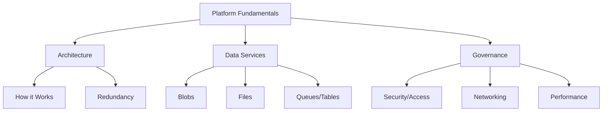

# Platform Fundamentals

This section covers the core architectural components and operational principles of the Azure Storage platform.

| Page | Description |
| :--- | :--- |
| [How Azure Storage Works](how-azure-storage-works.md) | Overview of control plane, data plane, and endpoint structure. |
| [Storage Account Basics](storage-account-basics.md) | Comparison of account types, namespaces, and resource hierarchy. |
| [Blob Storage Basics](blob-storage-basics.md) | Introduction to object storage, containers, and access tiers. |
| [File Storage Basics](file-storage-basics.md) | Managed file shares using SMB and NFS protocols. |
| [Queue and Table Basics](queue-and-table-basics.md) | Simple asynchronous messaging and NoSQL key-value storage. |
| [Redundancy and Durability](redundancy-and-durability.md) | Data replication strategies including LRS, ZRS, and GRS. |
| [Access Models](access-models.md) | Authentication methods from Shared Keys to Managed Identities. |
| [Networking and Private Access](networking-and-private-access.md) | Securing storage with firewalls, Service Endpoints, and Private Endpoints. |
| [Performance and Scaling](performance-and-scaling-basics.md) | Understanding limits, partitioning, and throughput optimization. |

!!! note
    Read architecture and storage account fundamentals first, then branch into service-specific topics and operational constraints.

## See Also

- [Overview](../start-here/overview.md)
- [How Azure Storage Works](how-azure-storage-works.md)
- [Storage Account Basics](storage-account-basics.md)

## Sources
- [Azure Storage documentation](https://learn.microsoft.com/en-us/azure/storage/common/storage-introduction)
- [Azure Storage scalability and performance targets](https://learn.microsoft.com/en-us/azure/storage/common/scalability-targets-standard-account)
