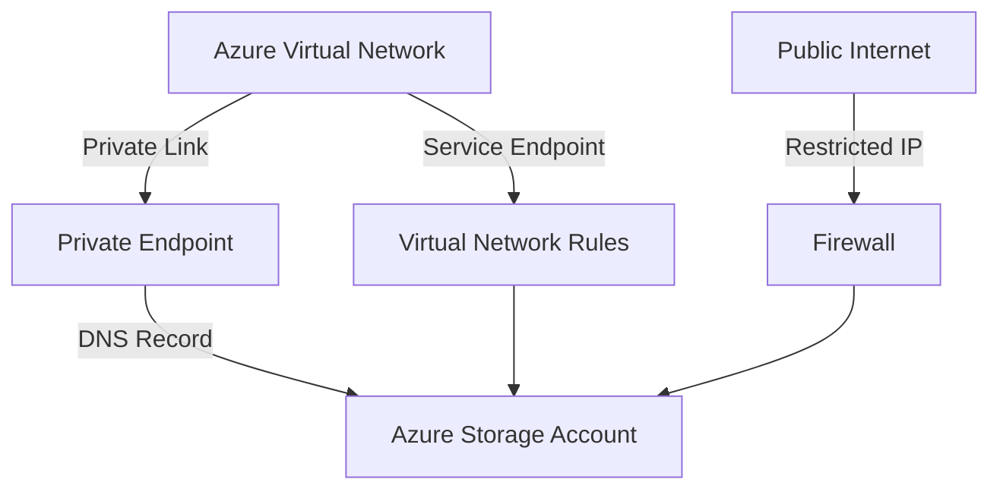

---
hide:
  - toc
content_sources:
  diagrams:
    - id: platform-networking-and-private-access
      type: flowchart
      source: mslearn-adapted
      mslearn_url: https://learn.microsoft.com/en-us/azure/storage/common/storage-network-security
---

# Networking and Private Access

Azure Storage provides multiple networking options to secure and control access to your data from different environments.

| Option | Security | DNS Impact | Cost | Best Use |
| :--- | :--- | :--- | :--- | :--- |
| **Public Access** | Lowest | None | Low | Dev/test only. |
| **Firewall** | Medium | None | Low | Trusted IP ranges. |
| **Service EP** | High | Public IP | Low | VNet-to-Service traffic. |
| **Private EP** | Highest | Private IP | High | Fully isolated access. |

<!-- diagram-id: platform-networking-and-private-access -->

!!! warning
    Private Endpoints require careful DNS configuration. You must resolve the storage account's FQDN to the private IP address within your virtual network.

    Creating a Private Endpoint does not automatically block access through the public endpoint. To fully isolate the account, disable public network access or configure storage firewall rules so public traffic is denied.

## Access Methods
- **Service Endpoints**: Optimizes routing but traffic still reaches the public endpoint.
- **Private Endpoints**: Traffic stays entirely within the Azure backbone, using a private IP. Public endpoint access remains enabled until you disable public network access or restrict it with firewall rules.
- **VNet Firewall**: Restricts access to specific subnets or IP addresses.

## See Also

- [Networking Best Practices](../best-practices/networking-best-practices.md)
- [Configure Network Rules](../operations/configure-network-rules.md)
- [Use Private Endpoints](../operations/use-private-endpoints.md)

## Sources
- [Configure Azure Storage firewalls and virtual networks](https://learn.microsoft.com/en-us/azure/storage/common/storage-network-security)
- [Use Private Endpoints for Azure Storage](https://learn.microsoft.com/en-us/azure/storage/common/storage-private-endpoints)
