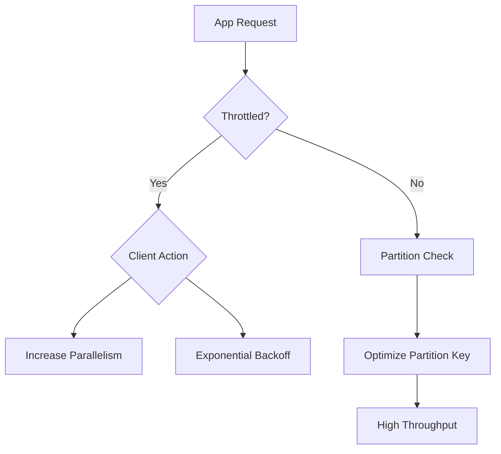

# Performance and Scaling Basics

Understanding performance limits and scaling targets is essential for designing efficient Azure Storage solutions.

| Metric | Standard Account | Premium Block Blob | Premium File Share |
| :--- | :--- | :--- | :--- |
| **IOPS** | Up to 20,000 | Up to 100,000 | Up to 100,000 |
| **Ingress** | Up to 60 Gbps | Up to 60 Gbps | Up to 60 Gbps |
| **Egress** | Up to 60 Gbps | Up to 60 Gbps | Up to 60 Gbps |
| **Capacity** | 5 PB per account | 5 PB per account | 100 TB per share |

!!! note
    Proper partition key design is critical for achieving high performance. A poorly chosen partition key can lead to "hot partitions," which limits scalability.

## Key Concepts
- **Throughput**: The amount of data transferred per second.
- **IOPS**: The number of input/output operations per second.
- **Partitioning**: Azure Storage uses a partition key to scale data across multiple servers.

## Sources
- [Azure Storage scalability and performance targets](https://learn.microsoft.com/en-us/azure/storage/common/scalability-targets-standard-account)
- [Performance and scalability checklist for Blob storage](https://learn.microsoft.com/en-us/azure/storage/blobs/storage-performance-checklist)
