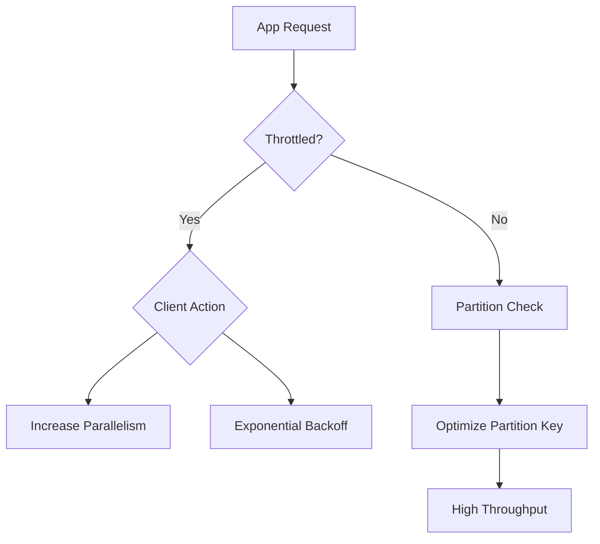

# Performance and Scaling Basics

Understanding performance limits and scaling targets is essential for designing efficient Azure Storage solutions.

| Metric | Standard Account | Premium Block Blob | Premium File Share |
| :--- | :--- | :--- | :--- |
| **IOPS** | Up to 20,000 (default); up to 40,000 in select regions | Service-specific premium targets (see source) | Up to 102,400 (provisioned SSD) |
| **Ingress** | Up to 25 Gbps (default); up to 60 Gbps in select regions | Service-specific premium targets (see source) | Service/account-level throughput targets apply |
| **Egress** | Up to 50 Gbps (default); up to 200 Gbps in select regions | Service-specific premium targets (see source) | Service/account-level throughput targets apply |
| **Capacity** | 5 PiB per account (default) | Service-specific premium targets (see source) | Up to 256 TiB (provisioned v2) |

!!! note
    Limits are region-dependent and workload-dependent. Higher capacity and ingress/egress limits can be requested through Azure Support.

## Key Concepts
- **Throughput**: The amount of data transferred per second.
- **IOPS**: The number of input/output operations per second.
- **Partitioning**: Azure Storage uses a partition key to scale data across multiple servers.

## See Also

- [Performance Best Practices](../best-practices/performance-best-practices.md)
- [Performance Terms](../reference/performance-terms.md)
- [Blob Storage Basics](blob-storage-basics.md)

## Sources
- [Azure Storage scalability and performance targets](https://learn.microsoft.com/en-us/azure/storage/common/scalability-targets-standard-account)
- [Performance and scalability checklist for Blob storage](https://learn.microsoft.com/en-us/azure/storage/blobs/storage-performance-checklist)
