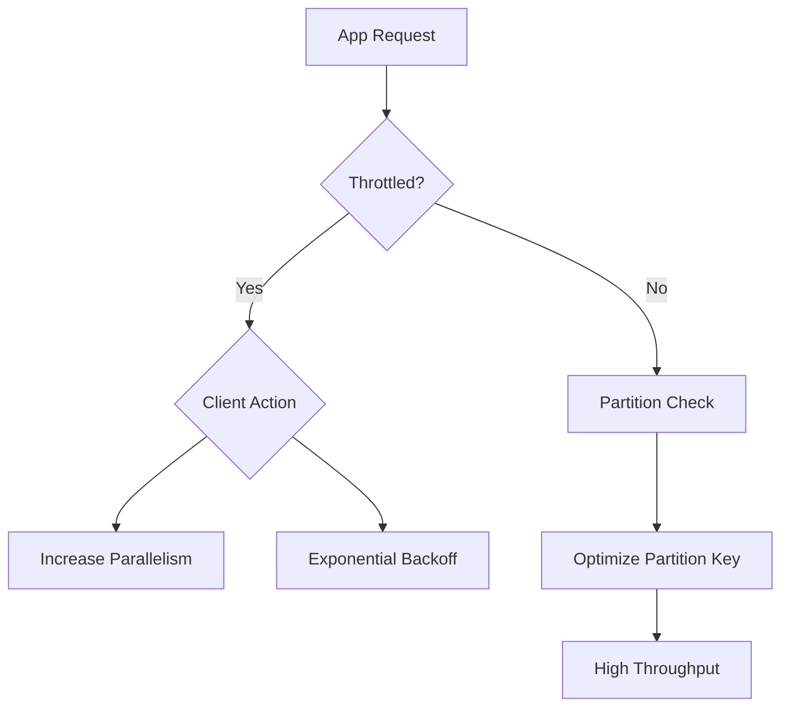

---
content_sources:
  diagrams:
  - id: platform-performance-and-scaling-basics
    type: flowchart
    source: mslearn-adapted
    mslearn_url: https://learn.microsoft.com/en-us/azure/storage/common/scalability-targets-standard-account
content_validation:
  status: verified
  last_reviewed: '2026-05-21'
  reviewer: ai-agent
  core_claims:
  - claim: Listed GPv2 regions, including Korea Central, have default maximum request
      rate target of 40,000 requests per second.
    source: https://learn.microsoft.com/en-us/azure/storage/common/scalability-targets-standard-account
    verified: true
  - claim: Listed GPv2 regions have default ingress and egress targets of 60 Gbps
      and 200 Gbps respectively.
    source: https://learn.microsoft.com/en-us/azure/storage/common/scalability-targets-standard-account
    verified: true
---
# Performance and Scaling Basics

Understanding performance limits and scaling targets is essential for designing efficient Azure Storage solutions.

| Metric | Standard Account | Premium Block Blob | Premium File Share |
| :--- | :--- | :--- | :--- |
| **Request Rate** | Up to 40,000 requests/sec in listed regions, including Korea Central; up to 20,000 requests/sec in other regions | Service-specific premium targets (see source) | Up to 102,400 (provisioned SSD) |
| **Ingress** | Up to 60 Gbps in listed regions; up to 25 Gbps in other regions | Service-specific premium targets (see source) | Service/account-level throughput targets apply |
| **Egress** | Up to 200 Gbps in listed regions; up to 50 Gbps in other regions | Service-specific premium targets (see source) | Service/account-level throughput targets apply |
| **Capacity** | 5 PiB per account (default) | Service-specific premium targets (see source) | Up to 256 TiB (provisioned v2) |

<!-- diagram-id: platform-performance-and-scaling-basics -->

```mermaid
graph TD
    App[App Request] --> Th{Throttled?}
    Th -- Yes --> Client{Client Action}
    Client --> Parallel[Increase Parallelism]
    Client --> Retry[Exponential Backoff]
    Th -- No --> Partition[Partition Check]
    Partition --> Key[Optimize Partition Key]
    Key --> Success[High Throughput]
```

!!! note
    Limits are region-dependent and workload-dependent. Microsoft Learn lists Korea Central among the regions with the higher default GPv2 request, ingress, and egress targets. Higher capacity and ingress/egress limits can be requested through Azure Support.

## Key Concepts
- **Throughput**: The amount of data transferred per second.
- **IOPS**: The number of input/output operations per second.
- **Partitioning**: Azure Storage uses a partition key to scale data across multiple servers.

## See Also

- [Performance Best Practices](../best-practices/performance-best-practices.md)
- [Performance Terms](../reference/performance-terms.md)
- [Blob Storage Basics](blob-storage-basics.md)

## Sources
- [Azure Storage scalability and performance targets](https://learn.microsoft.com/en-us/azure/storage/common/scalability-targets-standard-account)
- [Performance and scalability checklist for Blob storage](https://learn.microsoft.com/en-us/azure/storage/blobs/storage-performance-checklist)
