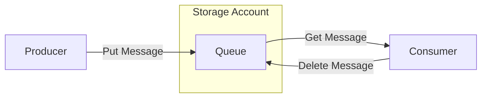

# Queue and Table Basics

Azure Queue and Table Storage provide lightweight, scalable solutions for asynchronous messaging and NoSQL data storage.

| Feature | Queue Storage | Table Storage |
| :--- | :--- | :--- |
| **Purpose** | Asynchronous messaging. | NoSQL key-value storage. |
| **Data Model** | Messages (up to 64 KB). | Entities with properties. |
| **Access Pattern** | First-In-First-Out (best effort). | Point lookups and range scans. |
| **Scalability** | Up to 2000 messages per second. | Up to 20,000 entities per second. |

## Service Overviews
- **Queue Storage**: Used to store and retrieve messages. It helps decouple application components for better scalability and reliability.
- **Table Storage**: Stores large amounts of structured data. The service is a NoSQL datastore which accepts authenticated calls from inside and outside the Azure cloud.

## Key Considerations
- **Queues**: Best for task offloading and cross-service communication.
- **Tables**: Cost-effective for metadata, web applications, and address books.

## Sources
- [What is Azure Queue Storage?](https://learn.microsoft.com/en-us/azure/storage/queues/storage-queues-introduction)
- [What is Azure Table Storage?](https://learn.microsoft.com/en-us/azure/storage/tables/table-storage-overview)
