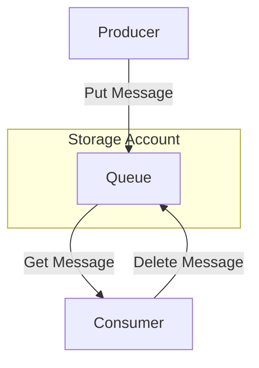

---
content_sources:
  diagrams:
  - id: platform-queue-and-table-basics
    type: flowchart
    source: mslearn-adapted
    mslearn_url: https://learn.microsoft.com/en-us/azure/storage/queues/storage-queues-introduction
content_validation:
  status: verified
  last_reviewed: '2026-05-21'
  reviewer: ai-agent
  core_claims:
  - claim: Queue and Table Basics guidance is based on linked Azure Storage source
      material.
    source: https://learn.microsoft.com/en-us/azure/storage/queues/storage-queues-introduction
    verified: true
  - claim: This page keeps Azure Storage guidance traceable to linked Microsoft Learn
      source material.
    source: https://learn.microsoft.com/en-us/azure/storage/queues/storage-queues-introduction
    verified: true
---
# Queue and Table Basics

Azure Queue and Table Storage provide lightweight, scalable solutions for asynchronous messaging and NoSQL data storage.

| Feature | Queue Storage | Table Storage |
| :--- | :--- | :--- |
| **Purpose** | Asynchronous messaging. | NoSQL key-value storage. |
| **Data Model** | Messages (up to 64 KB). | Entities with properties. |
| **Access Pattern** | First-In-First-Out (best effort). | Point lookups and range scans. |
| **Scalability** | Depends on partitioning and workload; refer to current service limits. | Depends on partitioning and workload; refer to current service limits. |

<!-- diagram-id: platform-queue-and-table-basics -->

```mermaid
graph TD
    P[Producer] -- Put Message --> Q[Queue]
    Q -- Get Message --> C[Consumer]
    C -- Delete Message --> Q
    subgraph Storage Account
        Q
    end
```

## Service Overviews
- **Queue Storage**: Used to store and retrieve messages. It helps decouple application components for better scalability and reliability.
- **Table Storage**: Stores large amounts of structured data. The service is a NoSQL datastore which accepts authenticated calls from inside and outside the Azure cloud.

## Key Considerations
- **Queues**: Best for task offloading and cross-service communication.
- **Tables**: Cost-effective for metadata, web applications, and address books.

!!! note
    Throughput can vary by account configuration, partition key distribution, and request patterns. Validate targets against the latest documented service limits before production sizing.

## See Also

- [How Azure Storage Works](how-azure-storage-works.md)
- [Performance and Scaling Basics](performance-and-scaling-basics.md)
- [Storage Service Selection Guide](../reference/storage-service-selection-guide.md)

## Sources
- [What is Azure Queue Storage?](https://learn.microsoft.com/en-us/azure/storage/queues/storage-queues-introduction)
- [What is Azure Table Storage?](https://learn.microsoft.com/en-us/azure/storage/tables/table-storage-overview)
