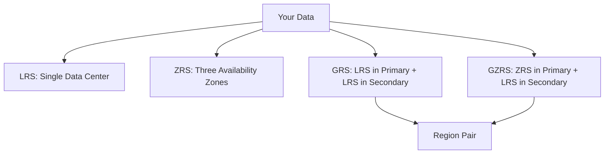

# Redundancy and Durability

Azure Storage always stores multiple copies of your data so that it is protected from planned and unplanned events.

| Option | Copies | Scope | Durability | Availability | Failover |
| :--- | :--- | :--- | :--- | :--- | :--- |
| **LRS** | 3 | Single DC | 11 nines | 99.9% | No |
| **ZRS** | 3 | Across Zones | 12 nines | 99.99% | No |
| **GRS** | 6 | Across Regions | 16 nines | 99.9% | Manual/Auto |
| **GZRS** | 6 | Zone + Region | 16 nines | 99.99% | Manual/Auto |

!!! warning
    Replication is not a backup. It protects against hardware or datacenter failure, but it does not protect against accidental deletion or data corruption.

## Key Concepts
- **Durability**: The likelihood that data remains accessible and uncorrupted over time.
- **Availability**: The percentage of time that a system is operational and accessible.
- **Region Pair**: Each Azure region is paired with another within the same geography.

## See Also

- [Redundancy and DR Best Practices](../best-practices/redundancy-and-dr-best-practices.md)
- [Redundancy Options Reference](../reference/redundancy-options.md)
- [How Azure Storage Works](how-azure-storage-works.md)

## Sources
- [Azure Storage redundancy](https://learn.microsoft.com/en-us/azure/storage/common/storage-redundancy)
- [Availability zones and regions](https://learn.microsoft.com/en-us/azure/reliability/availability-zones-overview)
