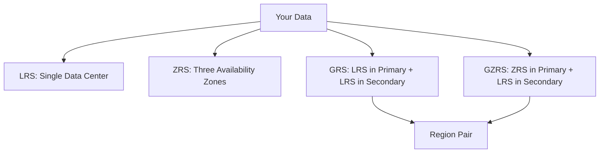

---
content_sources:
  diagrams:
  - id: platform-redundancy-and-durability
    type: flowchart
    source: mslearn-adapted
    mslearn_url: https://learn.microsoft.com/en-us/azure/storage/common/storage-redundancy
content_validation:
  status: verified
  last_reviewed: '2026-05-21'
  reviewer: ai-agent
  core_claims:
  - claim: Azure Storage supports LRS, ZRS, GRS, GZRS, RA-GRS, and RA-GZRS redundancy
      options for eligible services.
    source: https://learn.microsoft.com/en-us/azure/storage/common/storage-redundancy
    verified: true
  - claim: Azure Files does not support RA-GRS or RA-GZRS read-access geo-redundant
      options.
    source: https://learn.microsoft.com/en-us/azure/storage/files/files-redundancy
    verified: true
---
# Redundancy and Durability

Azure Storage always stores multiple copies of your data so that it is protected from planned and unplanned events.

| Option | Copies | Scope | Durability | Availability | Failover |
| :--- | :--- | :--- | :--- | :--- | :--- |
| **LRS** | 3 | Single DC | 11 nines | 99.9% | No |
| **ZRS** | 3 | Across Zones | 12 nines | 99.9% | No |
| **GRS** | 6 | Across Regions | 16 nines | 99.9% | Customer-managed |
| **GZRS** | 6 | Zone + Region | 16 nines | 99.9% | Customer-managed |
| **RA-GRS** | 6 | Across Regions | 16 nines | 99.99% (read) | Read from secondary for supported services |
| **RA-GZRS** | 6 | Zone + Region | 16 nines | 99.99% (read) | Read from secondary for supported services |

!!! important "Azure Files exception"
    Azure Files does not support RA-GRS or RA-GZRS. For eligible Azure Files HDD SMB shares, use GRS or GZRS for geo-redundancy. If a storage account is configured as RA-GRS or RA-GZRS, Azure Files is configured and billed as GRS or GZRS, and file shares are not readable in the secondary region unless failover occurs.

<!-- diagram-id: platform-redundancy-and-durability -->

```mermaid
graph TD
    Data[Your Data] --> LRS[LRS: Single Data Center]
    Data --> ZRS[ZRS: Three Availability Zones]
    Data --> GRS[GRS: LRS in Primary + LRS in Secondary]
    Data --> GZRS[GZRS: ZRS in Primary + LRS in Secondary]
    GRS --> RP[Region Pair]
    GZRS --> RP
```

!!! warning
    Replication is not a backup. It protects against hardware or datacenter failure, but it does not protect against accidental deletion or data corruption.

## Key Concepts
- **Durability**: The likelihood that data remains accessible and uncorrupted over time.
- **Availability**: The percentage of time that a system is operational and accessible.
- **Region Pair**: Each Azure region is paired with another within the same geography.

## See Also

- [Redundancy and DR Best Practices](../best-practices/redundancy-and-dr-best-practices.md)
- [Redundancy Options Reference](../reference/redundancy-options.md)
- [How Azure Storage Works](how-azure-storage-works.md)

## Sources
- [Azure Storage redundancy](https://learn.microsoft.com/en-us/azure/storage/common/storage-redundancy)
- [Azure Files data redundancy](https://learn.microsoft.com/en-us/azure/storage/files/files-redundancy)
- [Availability zones and regions](https://learn.microsoft.com/en-us/azure/reliability/availability-zones-overview)
