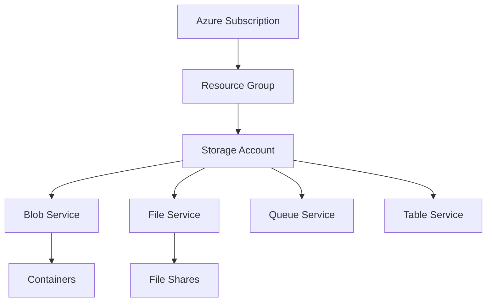

# Storage Account Basics

The storage account is a containers for all your Azure Storage data objects, including blobs, files, queues, and tables.

| Account Type | Services Supported | Hardware/Performance | Recommended Use |
| :--- | :--- | :--- | :--- |
| **Standard V2** | Blobs, Files, Queues, Tables | Standard HDD/SSD | General-purpose workloads. |
| **Premium Block Blobs** | Blobs (Append, Block) | Premium SSD | High-transaction, low-latency apps. |
| **Premium File Shares** | Azure Files only | Premium SSD | Enterprise-scale file shares. |
| **Premium Page Blobs** | Page Blobs only | Premium SSD | Disk-heavy workloads. |

!!! note
    Standard general-purpose v2 is the recommended default for most scenarios. It provides the latest features and unified pricing models.

## Key Considerations
- **Namespace**: Provides a unique HTTP endpoint globally.
- **Region**: Strategic placement for proximity and compliance.
- **Replication**: Configured at the account level for durability.

## Sources
- [Storage account overview](https://learn.microsoft.com/en-us/azure/storage/common/storage-account-overview)
- [Storage account types comparison](https://learn.microsoft.com/en-us/azure/storage/common/storage-account-overview#types-of-storage-accounts)
