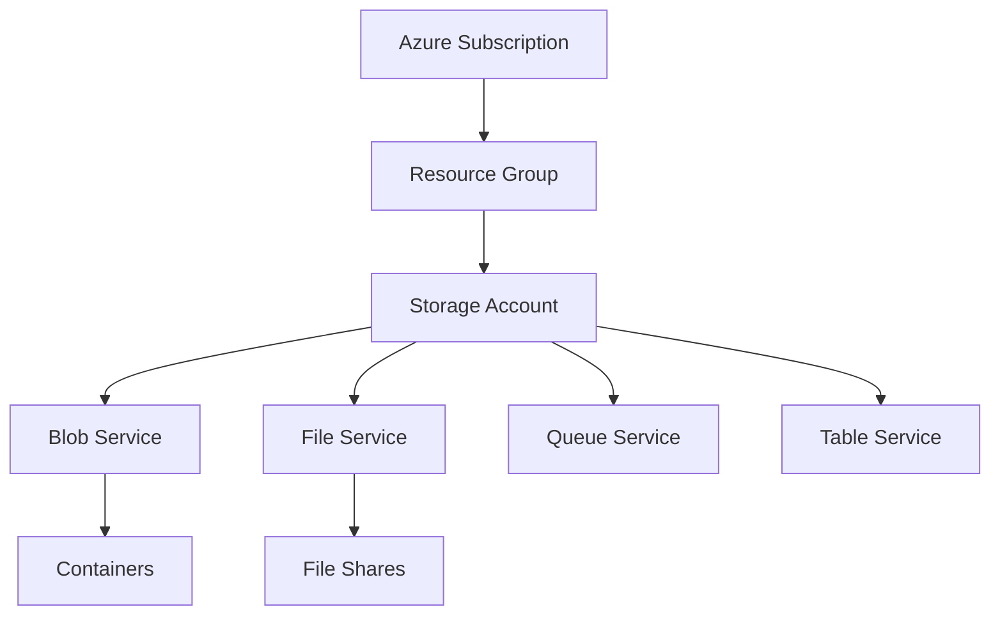

---
content_sources:
  diagrams:
    - id: platform-storage-account-basics
      type: flowchart
      source: mslearn-adapted
      mslearn_url: https://learn.microsoft.com/en-us/azure/storage/common/storage-account-overview
content_validation:
  status: pending_review
  last_reviewed: '2026-07-25'
  reviewer: agent
  core_claims:
    - claim: A storage account is the top-level namespace for Azure Storage services and data.
      source: https://learn.microsoft.com/en-us/azure/storage/common/storage-account-overview
      verified: false
    - claim: General-purpose v2 accounts are the recommended default for most Azure Storage workloads.
      source: https://learn.microsoft.com/en-us/azure/storage/common/storage-account-overview#types-of-storage-accounts
      verified: false
---

# Storage Account Basics

A storage account is the container for all your Azure Storage data objects, including blobs, files, queues, and tables.

| Account Type | Services Supported | Hardware/Performance | Recommended Use |
| :--- | :--- | :--- | :--- |
| **Standard V2** | Blobs, Files, Queues, Tables | Standard HDD/SSD | General-purpose workloads. |
| **Premium Block Blobs** | Blobs (Append, Block) | Premium SSD | High-transaction, low-latency apps. |
| **Premium File Shares** | Azure Files only | Premium SSD | Enterprise-scale file shares. |
| **Premium Page Blobs** | Page Blobs only | Premium SSD | Disk-heavy workloads. |

<!-- diagram-id: platform-storage-account-basics -->

```mermaid
graph TD
    Sub[Azure Subscription] --> RG[Resource Group]
    RG --> Acc[Storage Account]
    Acc --> B[Blob Service]
    Acc --> F[File Service]
    Acc --> Q[Queue Service]
    Acc --> T[Table Service]
    B --> B1[Containers]
    F --> F1[File Shares]
```

!!! note
    Standard general-purpose v2 is the recommended default for most scenarios. It provides the latest features and unified pricing models.

## Key Considerations
- **Namespace**: Provides a unique HTTP endpoint globally.
- **Region**: Strategic placement for proximity and compliance.
- **Replication**: Configured at the account level for durability.

## See Also

- [How Azure Storage Works](how-azure-storage-works.md)
- [Create a Storage Account](../operations/create-storage-account.md)
- [Storage Account Design Baseline](../best-practices/storage-account-design-baseline.md)

## Sources
- [Storage account overview](https://learn.microsoft.com/en-us/azure/storage/common/storage-account-overview)
- [Storage account types comparison](https://learn.microsoft.com/en-us/azure/storage/common/storage-account-overview#types-of-storage-accounts)
