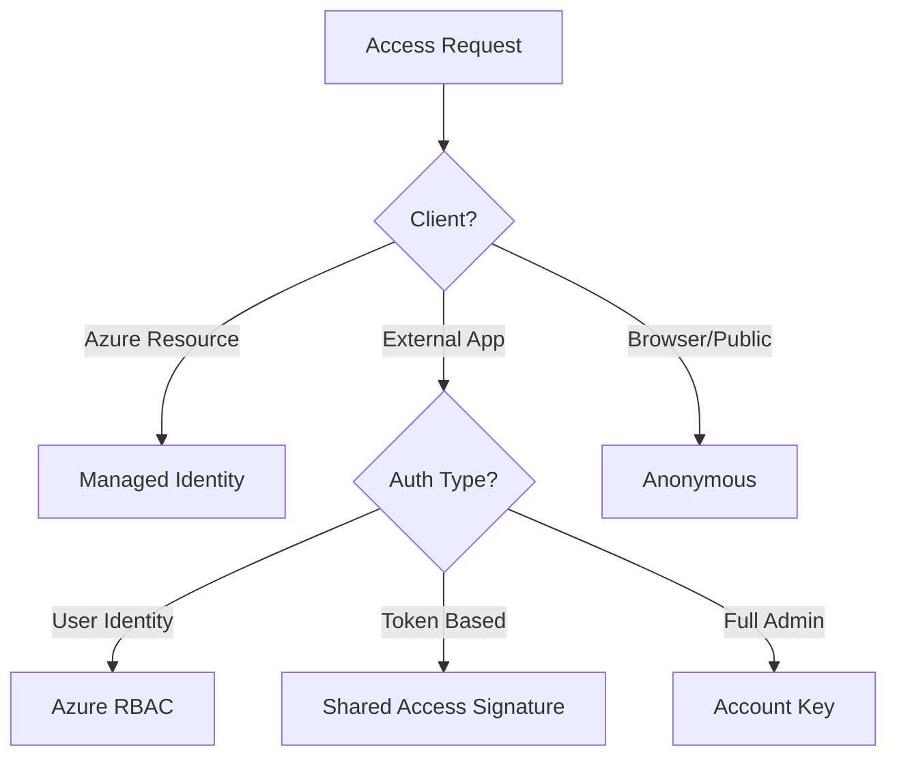

# Access Methods Cheatsheet

Azure Storage supports multiple authorization mechanisms to control data access.

## Comparison Table

| Method | Scope | Expiration | Security | Recommended Use |
| --- | --- | --- | --- | --- |
| Account Key | Storage Account | None | Low | Administrative scripts |
| SAS | Container/Blob | Fixed | Medium | Temporary client access |
| RBAC | Subscription/Account | Dynamic | High | Management operations |
| Managed Identity | Resource | Dynamic | High | Azure-to-Azure communication |
| Anonymous | Container/Blob | None | None | Public assets (e.g. website) |

## Access Method Decision Flow

!!! warning
    Anonymous public read access is disabled by default for new storage accounts. You must explicitly allow public access at the account level before enabling it for containers.

## Sources

- [Authorize access to data in Azure Storage](https://learn.microsoft.com/en-us/azure/storage/common/storage-auth)
- [Grant limited access to Azure Storage resources using SAS](https://learn.microsoft.com/en-us/azure/storage/common/storage-sas-overview)
