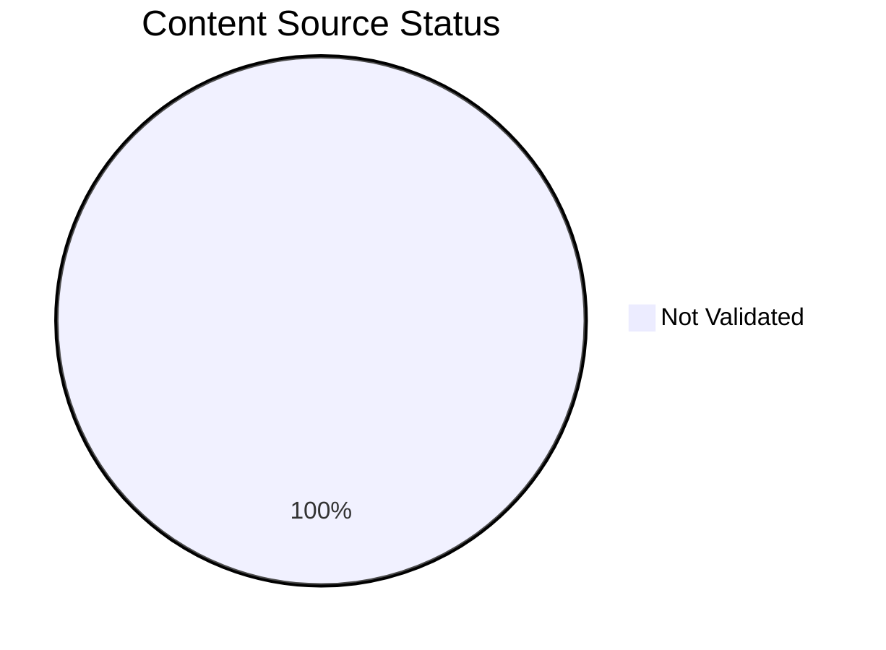
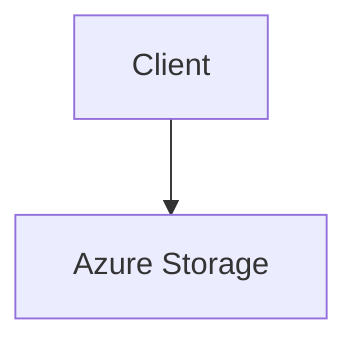

# Content Source Validation Status

This page tracks the source validation status of documentation content, including diagrams and text. All content must be traceable to official Microsoft Learn documentation.

## Summary

*Generated: 2026-04-10*

| Content Type | Total | MS Learn Sourced | Self-Generated | No Source |
|---|---:|---:|---:|---:|
| Mermaid Diagrams | 89 | 0 | 0 | 89 |
| Text Sections | — | — | — | — |

!!! warning "Validation Required"
    All 89 mermaid diagrams require source validation. Content without Microsoft Learn sources must be either:
    
    1. Linked to an official Microsoft Learn URL, or
    2. Marked as `self-generated` with clear justification



## Validation Categories

### Source Types

| Type | Description | Allowed? |
|---|---|---|
| `mslearn` | Content directly from Microsoft Learn | Yes |
| `mslearn-adapted` | Microsoft Learn content adapted for this guide | Yes, with source URL |
| `self-generated` | Original content created for this guide | Requires justification |
| `community` | From community sources | Not for core content |
| `unknown` | Source not documented | Must be validated |

### Diagram Validation Status

All mermaid diagrams are currently marked as not validated.

## How to Validate Content

### Step 1: Add Source Metadata to Frontmatter

Add `content_sources` to the document's YAML frontmatter:

```yaml
---
title: Example Page
content_sources:
  diagrams:
    - id: architecture-overview
      type: flowchart
      source: mslearn
      mslearn_url: https://learn.microsoft.com/en-us/azure/storage/
    - id: request-flow
      type: sequence
      source: self-generated
      justification: "Synthesized from multiple Microsoft Learn articles for clarity"
      based_on:
        - https://learn.microsoft.com/en-us/azure/storage/
  text:
    - section: "## Summary"
      source: mslearn-adapted
      mslearn_url: https://learn.microsoft.com/en-us/azure/storage/
---
```

### Step 2: Mark Diagram Blocks with IDs

Add an HTML comment before each mermaid block to identify it:

```markdown
<!-- diagram-id: architecture-overview -->

```

### Step 3: Run Validation Script

```bash
python3 scripts/validate_content_sources.py
```

### Step 4: Update This Page

```bash
python3 scripts/generate_content_validation_status.py
```

## Validation Rules

!!! danger "Mandatory Rules"
    1. Platform diagrams (`docs/platform/`) must have Microsoft Learn sources
    2. Architecture diagrams must reference official Microsoft documentation
    3. Troubleshooting flowcharts may be self-generated if they synthesize Microsoft Learn content
    4. Self-generated content must have a `justification` field explaining the source basis

## See Also

- [Validation Status](validation-status.md)
- [Reference Index](index.md)

## Sources

- [Microsoft Learn: Azure Storage documentation](https://learn.microsoft.com/en-us/azure/storage/)
