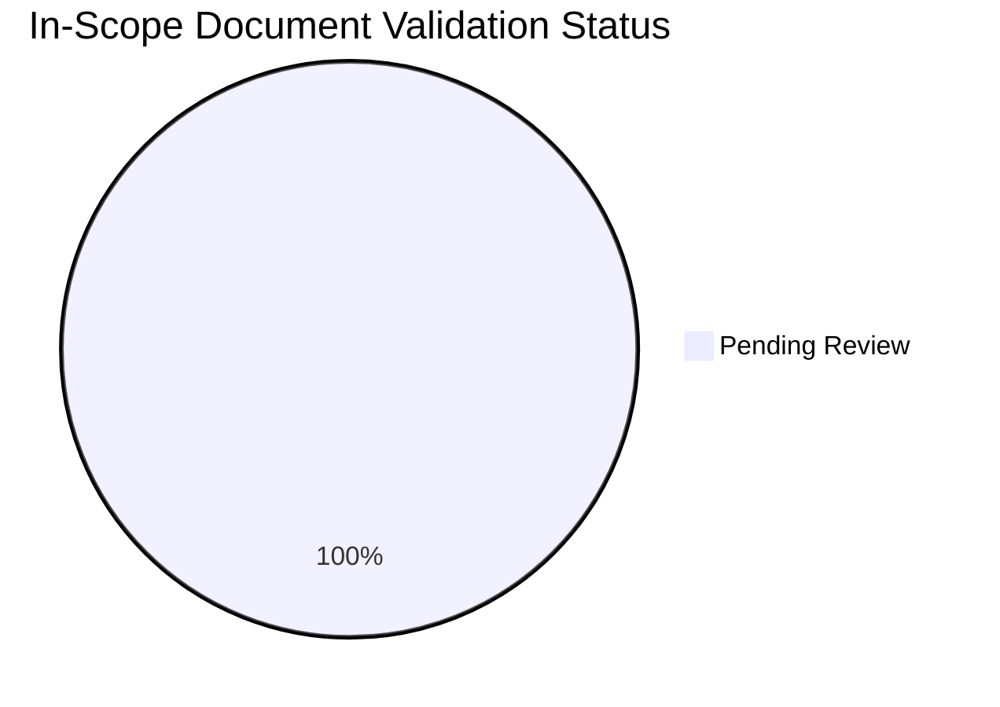

# Content Validation Status

This page tracks `content_validation` metadata for in-scope factual-claim documents under `docs/platform/`, `docs/best-practices/`, `docs/operations/`, and `docs/troubleshooting/`. Start-here pages, tutorials, reference pages, contributing docs, and navigation-only indexes are intentionally out of scope.

Navigation-only indexes excluded from this dashboard: `docs/best-practices/index.md`, `docs/operations/index.md`, `docs/platform/index.md`, `docs/troubleshooting/first-10-minutes/index.md`, `docs/troubleshooting/index.md`, `docs/troubleshooting/playbooks/index.md`.

## Summary

*Generated: 2026-07-25*

| Content Type | Total | Verified | Pending | Unverified | No Metadata |
|---|---:|---:|---:|---:|---:|
| Mermaid Diagrams | 95 | 95 | 0 | 0 | 0 |
| In-Scope Factual-Claim Documents | 49 | 0 | 49 | 0 | 0 |

<!-- diagram-id: reference-content-validation-status -->

```mermaid
pie title In-Scope Document Validation Status
    "Pending Review" : 49
```

## By Section

### Platform

| Document | Status | Claims | Last Reviewed |
|---|---|---|---|
| [Access Models](../platform/access-models.md) | ⚠️ Pending Review | 0/2 | 2026-07-25 |
| [Blob Storage Basics](../platform/blob-storage-basics.md) | ⚠️ Pending Review | 0/2 | 2026-07-25 |
| [File Storage Basics](../platform/file-storage-basics.md) | ⚠️ Pending Review | 0/2 | 2026-07-25 |
| [How Azure Storage Works](../platform/how-azure-storage-works.md) | ⚠️ Pending Review | 0/2 | 2026-07-25 |
| [Networking And Private Access](../platform/networking-and-private-access.md) | ⚠️ Pending Review | 0/2 | 2026-07-25 |
| [Performance And Scaling Basics](../platform/performance-and-scaling-basics.md) | ⚠️ Pending Review | 0/2 | 2026-07-25 |
| [Queue And Table Basics](../platform/queue-and-table-basics.md) | ⚠️ Pending Review | 0/2 | 2026-07-25 |
| [Redundancy And Durability](../platform/redundancy-and-durability.md) | ⚠️ Pending Review | 0/2 | 2026-07-25 |
| [Storage Account Basics](../platform/storage-account-basics.md) | ⚠️ Pending Review | 0/2 | 2026-07-25 |

### Best Practices

| Document | Status | Claims | Last Reviewed |
|---|---|---|---|
| [Blob Best Practices](../best-practices/blob-best-practices.md) | ⚠️ Pending Review | 0/2 | 2026-07-25 |
| [Common Anti Patterns](../best-practices/common-anti-patterns.md) | ⚠️ Pending Review | 0/2 | 2026-07-25 |
| [Cost Optimization Best Practices](../best-practices/cost-optimization-best-practices.md) | ⚠️ Pending Review | 0/2 | 2026-07-25 |
| [File Share Best Practices](../best-practices/file-share-best-practices.md) | ⚠️ Pending Review | 0/2 | 2026-07-25 |
| [Lifecycle Management Best Practices](../best-practices/lifecycle-management-best-practices.md) | ⚠️ Pending Review | 0/2 | 2026-07-25 |
| [Networking Best Practices](../best-practices/networking-best-practices.md) | ⚠️ Pending Review | 0/2 | 2026-07-25 |
| [Performance Best Practices](../best-practices/performance-best-practices.md) | ⚠️ Pending Review | 0/2 | 2026-07-25 |
| [Redundancy And Dr Best Practices](../best-practices/redundancy-and-dr-best-practices.md) | ⚠️ Pending Review | 0/2 | 2026-07-25 |
| [Security Best Practices](../best-practices/security-best-practices.md) | ⚠️ Pending Review | 0/2 | 2026-07-25 |
| [Storage Account Design Baseline](../best-practices/storage-account-design-baseline.md) | ⚠️ Pending Review | 0/2 | 2026-07-25 |

### Operations

| Document | Status | Claims | Last Reviewed |
|---|---|---|---|
| [Azcopy And Data Movement](../operations/azcopy-and-data-movement.md) | ⚠️ Pending Review | 0/2 | 2026-07-25 |
| [Backup And Data Protection](../operations/backup-and-data-protection.md) | ⚠️ Pending Review | 0/2 | 2026-07-25 |
| [Configure Access And Identity](../operations/configure-access-and-identity.md) | ⚠️ Pending Review | 0/2 | 2026-07-25 |
| [Configure Network Rules](../operations/configure-network-rules.md) | ⚠️ Pending Review | 0/2 | 2026-07-25 |
| [Create Storage Account](../operations/create-storage-account.md) | ⚠️ Pending Review | 0/2 | 2026-07-25 |
| [Manage Containers And Shares](../operations/manage-containers-and-shares.md) | ⚠️ Pending Review | 0/2 | 2026-07-25 |
| [Manage Lifecycle Policies](../operations/manage-lifecycle-policies.md) | ⚠️ Pending Review | 0/2 | 2026-07-25 |
| [Monitoring And Alerting](../operations/monitoring-and-alerting.md) | ⚠️ Pending Review | 0/2 | 2026-07-25 |
| [Use Private Endpoints](../operations/use-private-endpoints.md) | ⚠️ Pending Review | 0/2 | 2026-07-25 |

### Troubleshooting

| Document | Status | Claims | Last Reviewed |
|---|---|---|---|
| [Architecture Overview](../troubleshooting/architecture-overview.md) | ⚠️ Pending Review | 0/2 | 2026-07-25 |
| [Decision Tree](../troubleshooting/decision-tree.md) | ⚠️ Pending Review | 0/2 | 2026-07-25 |
| [Evidence Map](../troubleshooting/evidence-map.md) | ⚠️ Pending Review | 0/2 | 2026-07-25 |
| [Access](../troubleshooting/first-10-minutes/access.md) | ⚠️ Pending Review | 0/2 | 2026-07-25 |
| [Performance](../troubleshooting/first-10-minutes/performance.md) | ⚠️ Pending Review | 0/2 | 2026-07-25 |
| [Security](../troubleshooting/first-10-minutes/security.md) | ⚠️ Pending Review | 0/2 | 2026-07-25 |
| [Mental Model](../troubleshooting/mental-model.md) | ⚠️ Pending Review | 0/2 | 2026-07-25 |
| [Cannot Access Storage Account](../troubleshooting/playbooks/access/cannot-access-storage-account.md) | ⚠️ Pending Review | 0/2 | 2026-07-25 |
| [File Share Mount Issues](../troubleshooting/playbooks/access/file-share-mount-issues.md) | ⚠️ Pending Review | 0/2 | 2026-07-25 |
| [Private Endpoint And Dns Issues](../troubleshooting/playbooks/access/private-endpoint-and-dns-issues.md) | ⚠️ Pending Review | 0/2 | 2026-07-25 |
| [Public Vs Private Access Confusion](../troubleshooting/playbooks/access/public-vs-private-access-confusion.md) | ⚠️ Pending Review | 0/2 | 2026-07-25 |
| [Blob Access Denied](../troubleshooting/playbooks/blob-access-denied.md) | ⚠️ Pending Review | 0/2 | 2026-07-25 |
| [Lifecycle Policy Not Working](../troubleshooting/playbooks/lifecycle-policy-not-working.md) | ⚠️ Pending Review | 0/2 | 2026-07-25 |
| [Data Protection And Recovery Issues](../troubleshooting/playbooks/performance/data-protection-and-recovery-issues.md) | ⚠️ Pending Review | 0/2 | 2026-07-25 |
| [Slow Upload Download](../troubleshooting/playbooks/performance/slow-upload-download.md) | ⚠️ Pending Review | 0/2 | 2026-07-25 |
| [Throttling And Performance Issues](../troubleshooting/playbooks/performance/throttling-and-performance-issues.md) | ⚠️ Pending Review | 0/2 | 2026-07-25 |
| [Replication Lag Issues](../troubleshooting/playbooks/replication-lag-issues.md) | ⚠️ Pending Review | 0/2 | 2026-07-25 |
| [Authorization Failures](../troubleshooting/playbooks/security/authorization-failures.md) | ⚠️ Pending Review | 0/2 | 2026-07-25 |
| [Sas And Token Issues](../troubleshooting/playbooks/security/sas-and-token-issues.md) | ⚠️ Pending Review | 0/2 | 2026-07-25 |
| [Storage Throttling](../troubleshooting/playbooks/storage-throttling.md) | ⚠️ Pending Review | 0/2 | 2026-07-25 |
| [Quick Diagnosis Cards](../troubleshooting/quick-diagnosis-cards.md) | ⚠️ Pending Review | 0/2 | 2026-07-25 |

## Validation Status Values

| Status | Description |
|---|---|
| `verified` | All core claims on the page were confirmed against Microsoft Learn sources. |
| `pending_review` | The page has concrete core claims and source URLs, but one or more claims still need claim-level confirmation. |
| `unverified` | The page carries metadata but no claim-level review has been completed yet. |

## How to Update

Add a `content_validation` block only to in-scope factual-claim pages:

```yaml
---
content_validation:
  status: pending_review
  last_reviewed: 2026-07-25
  reviewer: agent
  core_claims:
    - claim: "Azure Storage supports locally redundant, zone-redundant, geo-redundant, and geo-zone-redundant replication options."
      source: https://learn.microsoft.com/en-us/azure/storage/common/storage-redundancy
      verified: false
---
```

The generator fails if a claim contains the placeholder marker `primary source basis`.

## See Also

- [Validation Status](validation-status.md)
- [Reference Index](index.md)

## Sources

- <https://learn.microsoft.com/en-us/azure/storage/>
