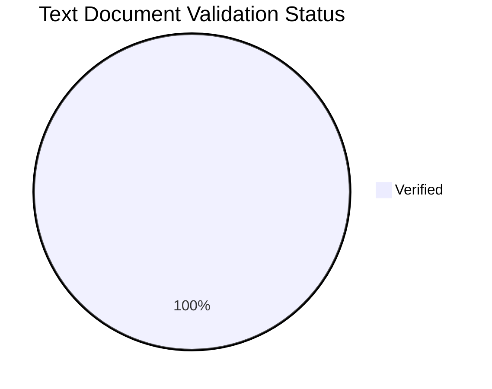

---
content_sources:
  diagrams:
  - id: content-validation-status-pie
    type: pie
    source: self-generated
    justification: Auto-generated dashboard from repository frontmatter.
  sources:
  - type: mslearn-adapted
    url: https://learn.microsoft.com/en-us/azure/storage/common/storage-introduction
content_validation:
  status: verified
  last_reviewed: '2026-05-23'
  reviewer: ai-agent
  core_claims:
  - claim: This dashboard is generated from content_validation frontmatter in this
      repository.
    source: scripts/generate_content_validation_status.py
    verified: true
  - claim: The repository content policy requires Microsoft Learn traceability for
      core Azure Storage guidance.
    source: https://learn.microsoft.com/en-us/azure/storage/
    verified: true
---
# Content Validation Status

This page is generated from `content_validation` frontmatter across non-tutorial documentation. It distinguishes verified pages from pages that have metadata but still need text-level source review.

## Summary

*Generated: 2026-05-23*

| Content Type | Total | Verified | Pending | Unverified | No Metadata |
|---|---:|---:|---:|---:|---:|
| Mermaid Diagrams | 79 | 79 | 0 | 0 | 0 |
| Text Documents | 71 | 71 | 0 | 0 | 0 |

<!-- diagram-id: content-validation-status-pie -->

```mermaid
pie title Text Document Validation Status
    "Verified" : 71
```

## By Section

### Root

| Document | Sources | Status | Claims | Last Reviewed |
|---|---|---|---:|---|
| [Index](../index.md) | yes | Verified | 2/2 | 2026-05-21 |

### Start Here

| Document | Sources | Status | Claims | Last Reviewed |
|---|---|---|---:|---|
| [Common Scenarios](../start-here/common-scenarios.md) | yes | Verified | 2/2 | 2026-05-21 |
| [Index](../start-here/index.md) | yes | Verified | 2/2 | 2026-05-21 |
| [Learning Path](../start-here/learning-path.md) | yes | Verified | 2/2 | 2026-05-21 |
| [Overview](../start-here/overview.md) | yes | Verified | 2/2 | 2026-05-21 |
| [Storage Services At A Glance](../start-here/storage-services-at-a-glance.md) | yes | Verified | 2/2 | 2026-05-21 |

### Platform

| Document | Sources | Status | Claims | Last Reviewed |
|---|---|---|---:|---|
| [Access Models](../platform/access-models.md) | yes | Verified | 2/2 | 2026-05-21 |
| [Blob Storage Basics](../platform/blob-storage-basics.md) | yes | Verified | 2/2 | 2026-05-21 |
| [File Storage Basics](../platform/file-storage-basics.md) | yes | Verified | 2/2 | 2026-05-21 |
| [How Azure Storage Works](../platform/how-azure-storage-works.md) | yes | Verified | 2/2 | 2026-05-21 |
| [Index](../platform/index.md) | yes | Verified | 2/2 | 2026-05-21 |
| [Networking And Private Access](../platform/networking-and-private-access.md) | yes | Verified | 2/2 | 2026-05-21 |
| [Performance And Scaling Basics](../platform/performance-and-scaling-basics.md) | yes | Verified | 2/2 | 2026-05-21 |
| [Queue And Table Basics](../platform/queue-and-table-basics.md) | yes | Verified | 2/2 | 2026-05-21 |
| [Redundancy And Durability](../platform/redundancy-and-durability.md) | yes | Verified | 2/2 | 2026-05-21 |
| [Storage Account Basics](../platform/storage-account-basics.md) | yes | Verified | 2/2 | 2026-05-21 |

### Best Practices

| Document | Sources | Status | Claims | Last Reviewed |
|---|---|---|---:|---|
| [Blob Best Practices](../best-practices/blob-best-practices.md) | yes | Verified | 2/2 | 2026-05-21 |
| [Common Anti Patterns](../best-practices/common-anti-patterns.md) | yes | Verified | 2/2 | 2026-05-21 |
| [Cost Optimization Best Practices](../best-practices/cost-optimization-best-practices.md) | yes | Verified | 2/2 | 2026-05-21 |
| [File Share Best Practices](../best-practices/file-share-best-practices.md) | yes | Verified | 2/2 | 2026-05-21 |
| [Index](../best-practices/index.md) | yes | Verified | 2/2 | 2026-05-21 |
| [Lifecycle Management Best Practices](../best-practices/lifecycle-management-best-practices.md) | yes | Verified | 2/2 | 2026-05-21 |
| [Networking Best Practices](../best-practices/networking-best-practices.md) | yes | Verified | 2/2 | 2026-05-21 |
| [Performance Best Practices](../best-practices/performance-best-practices.md) | yes | Verified | 2/2 | 2026-05-21 |
| [Redundancy And Dr Best Practices](../best-practices/redundancy-and-dr-best-practices.md) | yes | Verified | 2/2 | 2026-05-21 |
| [Security Best Practices](../best-practices/security-best-practices.md) | yes | Verified | 2/2 | 2026-05-21 |
| [Storage Account Design Baseline](../best-practices/storage-account-design-baseline.md) | yes | Verified | 2/2 | 2026-05-21 |

### Operations

| Document | Sources | Status | Claims | Last Reviewed |
|---|---|---|---:|---|
| [Azcopy And Data Movement](../operations/azcopy-and-data-movement.md) | yes | Verified | 2/2 | 2026-05-21 |
| [Backup And Data Protection](../operations/backup-and-data-protection.md) | yes | Verified | 2/2 | 2026-05-21 |
| [Configure Access And Identity](../operations/configure-access-and-identity.md) | yes | Verified | 2/2 | 2026-05-21 |
| [Configure Network Rules](../operations/configure-network-rules.md) | yes | Verified | 2/2 | 2026-05-21 |
| [Create Storage Account](../operations/create-storage-account.md) | yes | Verified | 2/2 | 2026-05-21 |
| [Index](../operations/index.md) | yes | Verified | 1/1 | 2026-05-21 |
| [Manage Containers And Shares](../operations/manage-containers-and-shares.md) | yes | Verified | 2/2 | 2026-05-21 |
| [Manage Lifecycle Policies](../operations/manage-lifecycle-policies.md) | yes | Verified | 2/2 | 2026-05-21 |
| [Monitoring And Alerting](../operations/monitoring-and-alerting.md) | yes | Verified | 2/2 | 2026-05-21 |
| [Use Private Endpoints](../operations/use-private-endpoints.md) | yes | Verified | 2/2 | 2026-05-21 |

### Troubleshooting

| Document | Sources | Status | Claims | Last Reviewed |
|---|---|---|---:|---|
| [Architecture Overview](../troubleshooting/architecture-overview.md) | yes | Verified | 2/2 | 2026-05-21 |
| [Decision Tree](../troubleshooting/decision-tree.md) | yes | Verified | 2/2 | 2026-05-21 |
| [Evidence Map](../troubleshooting/evidence-map.md) | yes | Verified | 2/2 | 2026-05-21 |
| [Access](../troubleshooting/first-10-minutes/access.md) | yes | Verified | 2/2 | 2026-05-21 |
| [Index](../troubleshooting/first-10-minutes/index.md) | yes | Verified | 2/2 | 2026-05-21 |
| [Performance](../troubleshooting/first-10-minutes/performance.md) | yes | Verified | 2/2 | 2026-05-21 |
| [Security](../troubleshooting/first-10-minutes/security.md) | yes | Verified | 2/2 | 2026-05-21 |
| [Index](../troubleshooting/index.md) | yes | Verified | 2/2 | 2026-05-21 |
| [Mental Model](../troubleshooting/mental-model.md) | yes | Verified | 2/2 | 2026-05-21 |
| [Cannot Access Storage Account](../troubleshooting/playbooks/access/cannot-access-storage-account.md) | yes | Verified | 2/2 | 2026-05-21 |
| [File Share Mount Issues](../troubleshooting/playbooks/access/file-share-mount-issues.md) | yes | Verified | 2/2 | 2026-05-21 |
| [Private Endpoint And Dns Issues](../troubleshooting/playbooks/access/private-endpoint-and-dns-issues.md) | yes | Verified | 2/2 | 2026-05-21 |
| [Public Vs Private Access Confusion](../troubleshooting/playbooks/access/public-vs-private-access-confusion.md) | yes | Verified | 2/2 | 2026-05-21 |
| [Blob Access Denied](../troubleshooting/playbooks/blob-access-denied.md) | yes | Verified | 2/2 | 2026-05-21 |
| [Index](../troubleshooting/playbooks/index.md) | yes | Verified | 2/2 | 2026-05-21 |
| [Lifecycle Policy Not Working](../troubleshooting/playbooks/lifecycle-policy-not-working.md) | yes | Verified | 2/2 | 2026-05-21 |
| [Data Protection And Recovery Issues](../troubleshooting/playbooks/performance/data-protection-and-recovery-issues.md) | yes | Verified | 2/2 | 2026-05-21 |
| [Slow Upload Download](../troubleshooting/playbooks/performance/slow-upload-download.md) | yes | Verified | 2/2 | 2026-05-21 |
| [Throttling And Performance Issues](../troubleshooting/playbooks/performance/throttling-and-performance-issues.md) | yes | Verified | 2/2 | 2026-05-21 |
| [Replication Lag Issues](../troubleshooting/playbooks/replication-lag-issues.md) | yes | Verified | 2/2 | 2026-05-21 |
| [Authorization Failures](../troubleshooting/playbooks/security/authorization-failures.md) | yes | Verified | 2/2 | 2026-05-21 |
| [Sas And Token Issues](../troubleshooting/playbooks/security/sas-and-token-issues.md) | yes | Verified | 2/2 | 2026-05-21 |
| [Storage Throttling](../troubleshooting/playbooks/storage-throttling.md) | yes | Verified | 2/2 | 2026-05-21 |
| [Quick Diagnosis Cards](../troubleshooting/quick-diagnosis-cards.md) | yes | Verified | 2/2 | 2026-05-21 |

### Reference

| Document | Sources | Status | Claims | Last Reviewed |
|---|---|---|---:|---|
| [Access Methods Cheatsheet](../reference/access-methods-cheatsheet.md) | yes | Verified | 2/2 | 2026-05-21 |
| [Content Validation Status](../reference/content-validation-status.md) | yes | Verified | 2/2 | 2026-05-21 |
| [Glossary](../reference/glossary.md) | yes | Verified | 2/2 | 2026-05-21 |
| [Index](../reference/index.md) | yes | Verified | 2/2 | 2026-05-21 |
| [Performance Terms](../reference/performance-terms.md) | yes | Verified | 2/2 | 2026-05-21 |
| [Redundancy Options](../reference/redundancy-options.md) | yes | Verified | 2/2 | 2026-05-21 |
| [Storage Networking Cheatsheet](../reference/storage-networking-cheatsheet.md) | yes | Verified | 2/2 | 2026-05-21 |
| [Storage Service Selection Guide](../reference/storage-service-selection-guide.md) | yes | Verified | 2/2 | 2026-05-21 |
| [Validation Status](../reference/validation-status.md) | yes | Verified | 2/2 | 2026-05-21 |

### Contributing

| Document | Sources | Status | Claims | Last Reviewed |
|---|---|---|---:|---|
| [Index](../contributing/index.md) | no | Verified | 2/2 | 2026-05-21 |

## How to Update

Add or update `content_validation` in a document's YAML frontmatter, then regenerate this page:

```bash
python3 scripts/generate_content_validation_status.py
```

| Field | Meaning |
|---|---|
| `status` | `verified`, `pending_review`, or `unverified` |
| `last_reviewed` | Date when the claims were last checked |
| `core_claims` | The factual claims tracked for source validation |

## See Also

- [Validation Status](validation-status.md)
- [Storage Service Selection Guide](storage-service-selection-guide.md)
- [Redundancy Options](redundancy-options.md)

## Sources

- [Microsoft Learn overview](https://learn.microsoft.com/en-us/azure/storage/common/storage-introduction)
