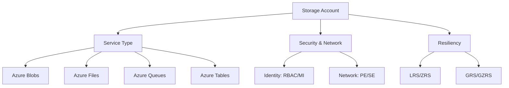

# Glossary

This glossary provides definitions for core Azure Storage concepts and features.

## Storage Terms and Definitions

| Term | Definition |
| --- | --- |
| Storage Account | Unique namespace for your Azure Storage data. |
| Blob | Binary Large Object; used for storing massive amounts of unstructured data. |
| Container | Logical grouping of blobs within a storage account. |
| Access Tier | Optimization level for blobs (Hot, Cool, Cold, Archive). |
| Azure Files | Fully managed cloud file shares using SMB and NFS. |
| File Share | Top-level object in Azure Files. |
| Queue | Message-passing service between application components. |
| Table | NoSQL key-value store for structured data. |
| SAS | Shared Access Signature; delegation of fine-grained access. |
| RBAC | Role-Based Access Control; identity-based security. |
| Managed Identity | Automatically managed identity in Azure AD for resources. |
| Private Endpoint | Network interface for private VNet access to storage. |
| Service Endpoint | Virtual firewall rule linking VNet to storage. |
| Redundancy | Strategy for data durability (LRS, ZRS, GRS, GZRS). |
| LRS | Locally Redundant Storage; 3 copies in one data center. |
| ZRS | Zone Redundant Storage; 3 copies across 3 availability zones. |
| GRS | Geo-Redundant Storage; async copy to secondary region. |
| Lifecycle Policy | Rules to automate data tiering or deletion. |
| Soft Delete | Mechanism to recover deleted blobs or containers. |
| Versioning | Feature to keep previous states of a blob. |
| AzCopy | Command-line tool for high-performance data transfer. |
| Data Lake Gen2 | Analytical storage optimized for big data workloads. |

## Core Concepts Relationship

## Sources

- [Azure Storage terminology](https://learn.microsoft.com/en-us/azure/storage/common/storage-introduction)
- [Azure Storage glossary of terms](https://learn.microsoft.com/en-us/azure/storage/blobs/storage-blobs-introduction)
