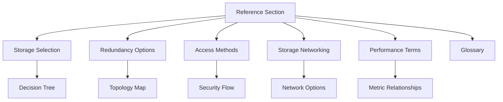

# Reference

This section provides quick lookup guides, technical comparisons, and dense summaries of Azure Storage core concepts. Use these tables and diagrams for architectural decision-making and performance tuning.

!!! note
    Use this section for fast lookup during design reviews and troubleshooting triage.

## Reference Topics

| Page | Description | Key Focus |
| --- | --- | --- |
| [Storage Selection](storage-service-selection-guide.md) | Workload-based service mapping | Blobs, Files, Disks |
| [Redundancy Options](redundancy-options.md) | Data protection levels | LRS, ZRS, GRS |
| [Access Methods](access-methods-cheatsheet.md) | Security and authentication | SAS, RBAC, Managed Identity |
| [Storage Networking](storage-networking-cheatsheet.md) | Connectivity and isolation | Private Endpoints, Firewalls |
| [Performance Terms](performance-terms.md) | Throughput and IOPS metrics | Latency, Throttling, Bursting |
| [Glossary](glossary.md) | Terminology definitions | Core components and features |

## Reference Architecture Map

## See Also

- [Storage Service Selection Guide](storage-service-selection-guide.md)
- [Glossary](glossary.md)
- [Learning Path](../start-here/learning-path.md)

## Sources

- [Azure Storage documentation](https://learn.microsoft.com/en-us/azure/storage/)
- [Azure Storage architectural guidance](https://learn.microsoft.com/en-us/azure/architecture/guide/technology-choices/data-store-overview)
