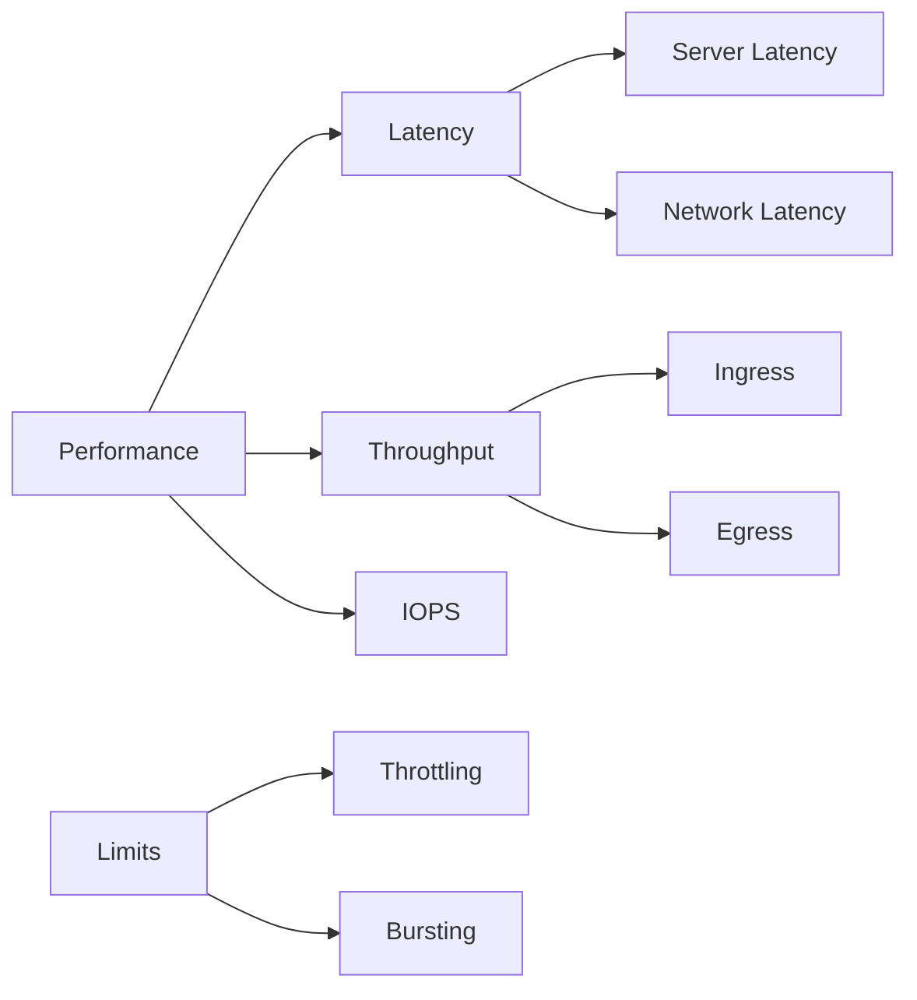

---
hide:
  - toc
content_sources:
  diagrams:
    - id: reference-performance-terms
      type: flowchart
      source: mslearn-adapted
      mslearn_url: https://learn.microsoft.com/en-us/azure/storage/common/storage-scalability-targets
---

# Performance Terms

Understanding Azure Storage performance metrics is critical for optimizing application throughput and latency.

!!! note
    Compare server latency and end-to-end latency together to separate backend pressure from client/network delay.

## Key Performance Metrics

| Term | Definition | Context |
| --- | --- | --- |
| IOPS | Input/Output Operations Per Second | Small random reads/writes |
| Throughput | Data transfer rate (MB/s or GB/s) | Large sequential transfers |
| Latency | Time to complete a single request | Measured in milliseconds |
| E2E Latency | Total time from request start to finish | Includes network transit |
| Server Latency | Time spent processing on Azure side | Excludes network transit |
| Ingress | Data flowing into the storage account | Uploads |
| Egress | Data flowing out of the storage account | Downloads |
| Transaction | A single REST API call | Billing and limit unit |
| Partition | Logical grouping of data for scale | Scaling unit |
| Throttling | Rate limiting when targets are exceeded | HTTP 429 errors |
| Bursting | Temporary boost above provisioned limit | Premium file shares |
| Premium | SSD-based high-performance tier | Low latency |
| Standard | HDD-based general-purpose tier | Cost-effective |
| Hot/Cool Tier | Access tiers for varying frequency | Performance/Cost trade-off |
| Cold | Online access tier | Immediate access; milliseconds latency |
| Archive | Offline access tier | Rehydration required; hours latency |

## Performance Concepts Relationship

<!-- diagram-id: reference-performance-terms -->

## See Also

- [Performance and Scaling Basics](../platform/performance-and-scaling-basics.md)
- [Performance Best Practices](../best-practices/performance-best-practices.md)
- [Throttling and Performance Issues](../troubleshooting/playbooks/performance/throttling-and-performance-issues.md)

## Sources

- [Azure Storage scalability and performance targets](https://learn.microsoft.com/en-us/azure/storage/common/storage-scalability-targets)
- [Monitoring Azure Storage performance](https://learn.microsoft.com/en-us/azure/storage/common/storage-monitoring-diagnosing-troubleshooting)
