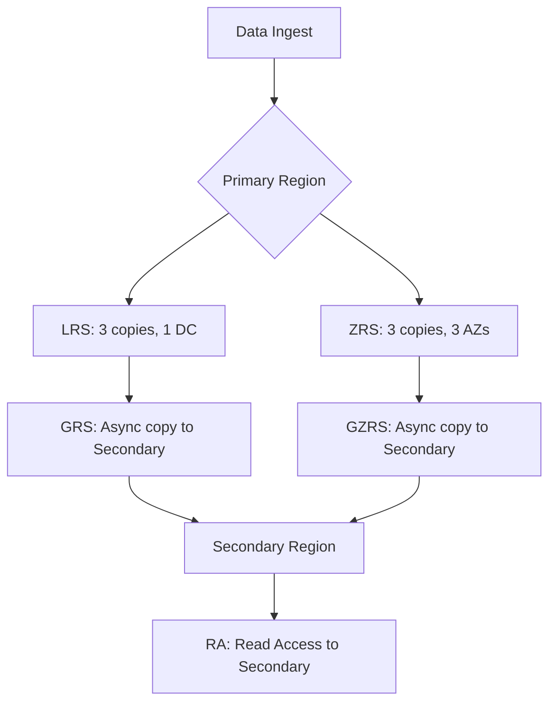

# Redundancy Options

Azure Storage provides multiple redundancy options to protect data from planned and unplanned events.

## Comparison Table

| Option | Copies | Regions | Availability Zone | Failover | Durability | Availability SLA |
| --- | --- | --- | --- | --- | --- | --- |
| LRS | 3 | Single | No | No | 11 nines | 99.9% (Cool 99%) |
| ZRS | 3 | Single | Yes | No | 12 nines | 99.99% (Cool 99.9%) |
| GRS | 6 | Two | No | Yes (Manual) | 16 nines | 99.9% (Cool 99%) |
| GZRS | 6 | Two | Yes | Yes (Manual) | 16 nines | 99.99% (Cool 99.9%) |
| RA-GRS | 6 | Two | No | Read-only | 16 nines | 99.9% Read/Write |
| RA-GZRS | 6 | Two | Yes | Read-only | 16 nines | 99.99% Read/Write |

## Redundancy Topology

## Sources

- [Azure Storage redundancy](https://learn.microsoft.com/en-us/azure/storage/common/storage-redundancy)
- [Review storage redundancy levels](https://learn.microsoft.com/en-us/azure/storage/common/storage-redundancy#redundancy-in-a-secondary-region)
