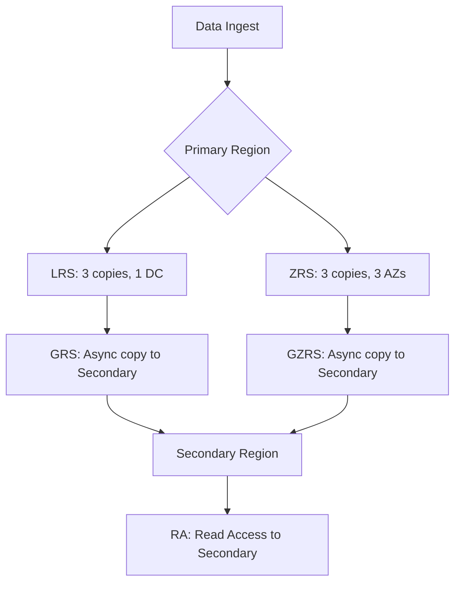

---
content_sources:
  diagrams:
  - id: reference-redundancy-options
    type: flowchart
    source: mslearn-adapted
    mslearn_url: https://learn.microsoft.com/en-us/azure/storage/common/storage-redundancy
content_validation:
  status: verified
  last_reviewed: '2026-05-21'
  reviewer: ai-agent
  core_claims:
  - claim: GRS and GZRS data in the secondary region is not directly available for
      read or write access unless failover occurs.
    source: https://learn.microsoft.com/en-us/azure/storage/common/storage-redundancy
    verified: true
  - claim: Azure Files does not support RA-GRS or RA-GZRS.
    source: https://learn.microsoft.com/en-us/azure/storage/files/files-redundancy
    verified: true
---
# Redundancy Options

Azure Storage provides multiple redundancy options to protect data from planned and unplanned events.

!!! note
    Secondary-region replication is asynchronous for GRS/GZRS and can have recovery point lag.

## Comparison Table

| Option | Copies | Regions | Availability Zone | Failover | Durability | Availability SLA |
| --- | --- | --- | --- | --- | --- | --- |
| LRS | 3 | Single | No | No | 11 nines | 99.9% (Cool 99%) |
| ZRS | 3 | Single | Yes | No | 12 nines | 99.9% (Cool 99%) |
| GRS | 6 | Two | No | Yes (Customer-managed) | 16 nines | 99.9% (Cool 99%) |
| GZRS | 6 | Two | Yes | Yes (Customer-managed) | 16 nines | 99.9% (Cool 99%) |
| RA-GRS | 6 | Two | No | Read from secondary | 16 nines | 99.99% read / 99.9% write |
| RA-GZRS | 6 | Two | Yes | Read from secondary | 16 nines | 99.99% read / 99.9% write |

!!! important "Azure Files exception"
    The RA-GRS and RA-GZRS rows apply only to services that support secondary read access. Azure Files does not support RA-GRS or RA-GZRS; eligible geo-redundant file shares use GRS or GZRS, and secondary-region access requires failover.

## Redundancy Topology

<!-- diagram-id: reference-redundancy-options -->

```mermaid
graph TD
    Data[Data Ingest] --> Primary{Primary Region}
    Primary --> LRS[LRS: 3 copies, 1 DC]
    Primary --> ZRS[ZRS: 3 copies, 3 AZs]
    
    LRS --> GRS[GRS: Async copy to Secondary]
    ZRS --> GZRS[GZRS: Async copy to Secondary]
    
    GRS --> Sec[Secondary Region]
    GZRS --> Sec
    
    Sec --> RA[RA: Read Access to Secondary]
```

## See Also

- [Redundancy and Durability](../platform/redundancy-and-durability.md)
- [Redundancy and DR Best Practices](../best-practices/redundancy-and-dr-best-practices.md)
- [Backup and Data Protection](../operations/backup-and-data-protection.md)

## Sources

- [Azure Storage redundancy](https://learn.microsoft.com/en-us/azure/storage/common/storage-redundancy)
- [Review storage redundancy levels](https://learn.microsoft.com/en-us/azure/storage/common/storage-redundancy#redundancy-in-a-secondary-region)
- [Azure Files data redundancy](https://learn.microsoft.com/en-us/azure/storage/files/files-redundancy)
