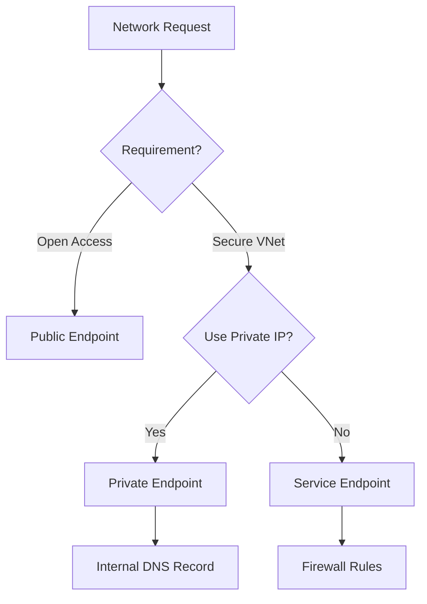

# Storage Networking Cheatsheet

Azure Storage provides several options for securing data access through network isolation.

## Networking Option Comparison

| Option | DNS Behavior | Security | Cost | Setup Complexity |
| --- | --- | --- | --- | --- |
| Public Access | Public IP | Low | Free | Minimal |
| Service Endpoint | Public IP (Virtual) | Medium | Free | Simple |
| Private Endpoint | Private VNet IP | High | Paid (Hourly + Data) | Moderate |
| Trusted Services | Internal Backbone | High | Free | Automatic |

## Networking Decision Flow

## Sources

- [Configure Azure Storage firewalls and virtual networks](https://learn.microsoft.com/en-us/azure/storage/common/storage-network-security)
- [Use Private Endpoints for Azure Storage](https://learn.microsoft.com/en-us/azure/storage/common/storage-private-endpoints)
