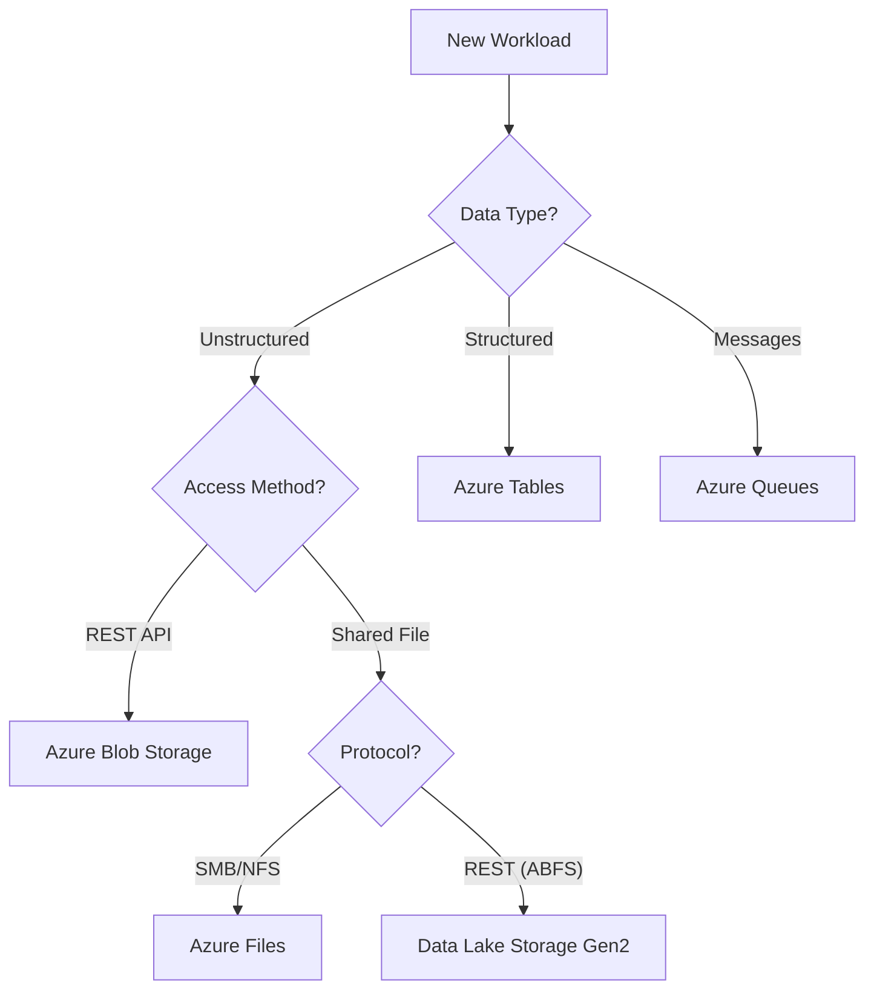

# Storage Service Selection Guide

Choosing the right storage service depends on data structure, access protocols, and performance requirements.

## Workload to Service Mapping

| Workload | Recommended Service | Data Type | Protocol | Scale |
| --- | --- | --- | --- | --- |
| Web assets, Big Data, Backup | Blob Storage | Unstructured | REST | PB+ |
| Shared file systems (Lift & Shift) | Azure Files | SMB/NFS | SMB/NFS/REST | 100TiB+ |
| High-volume messaging | Azure Queues | Messages | REST | Account limit |
| NoSQL key-value storage | Azure Tables | Structured | REST | Account limit |
| Large-scale analytics | Blob Storage with Data Lake Storage Gen2 | Hierarchical namespace | REST (Hadoop-compatible via ABFS) | PB+ |

## Selection Decision Tree

!!! tip
    Use Azure Files for shared application data when multiple VMs need concurrent access to the same file system without rewriting code.

## See Also

- [Storage Services at a Glance](../start-here/storage-services-at-a-glance.md)
- [Blob Storage Basics](../platform/blob-storage-basics.md)
- [File Storage Basics](../platform/file-storage-basics.md)

## Sources

- [Choose an Azure storage service](https://learn.microsoft.com/en-us/azure/storage/common/storage-introduction#azure-storage-services)
- [Review your storage options](https://learn.microsoft.com/en-us/azure/architecture/guide/technology-choices/data-store-overview)
