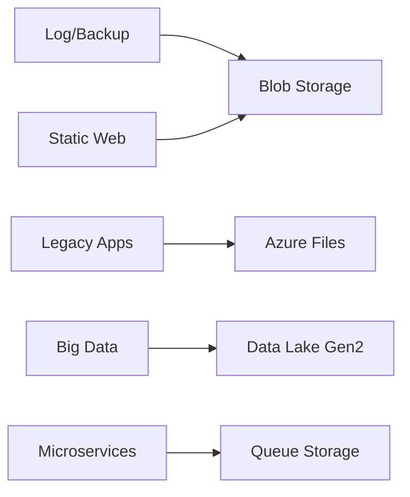

# Common Scenarios

Azure Storage is used in diverse scenarios across cloud applications. This section maps business requirements to the most effective storage services.

## Scenario Mapping

| Scenario | Service | Key Consideration |
| -------- | ------- | ----------------- |
| App File Storage | Blobs | Use Hot tier for active files |
| Log/Backup | Blobs | Archive tier for long-term retention |
| Static Content | Blobs | CDN integration for low latency |
| Function Runtime | Files | Requires SMB for internal state |
| Lift-and-Shift | Files | AD integration for permissions |
| Big Data | Data Lake | Hierarchical namespace for performance |

## Scenario Service Selection

## Implementation Advice

- Use lifecycle management policies to move data to cheaper tiers automatically.
- Enable soft delete to protect against accidental data loss.
- Utilize shared access signatures (SAS) to grant limited access to storage resources.

!!! tip
    Start with one scenario as a baseline architecture, then iterate with security and performance controls from the Platform and Best Practices sections.

## See Also

- [Create a Storage Account](../operations/create-storage-account.md)
- [Use Private Endpoints](../operations/use-private-endpoints.md)
- [Troubleshooting Index](../troubleshooting/index.md)

## Sources

- [Common Azure Storage scenarios](https://learn.microsoft.com/en-us/azure/storage/common/storage-introduction#core-storage-services)
- [Optimize costs with access tiers](https://learn.microsoft.com/en-us/azure/storage/blobs/access-tiers-overview)
