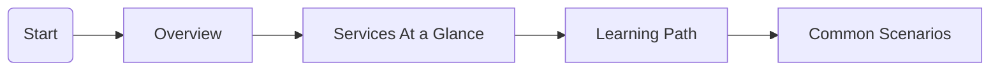

# Start Here

Begin your journey into Azure Storage. This section provides the fundamental context needed to understand the more technical sections of the guide.

## Section Contents

| Page | Description |
| ---- | ----------- |
| [Overview](overview.md) | Fundamentals of Azure Storage and its importance |
| [Learning Path](learning-path.md) | Structured routes for different job roles |
| [Services At a Glance](storage-services-at-a-glance.md) | High-level comparison of all storage services |
| [Common Scenarios](common-scenarios.md) | Real-world applications and use cases |

## Reading Path

## Sources

- [Azure Storage Overview](https://learn.microsoft.com/en-us/azure/storage/common/storage-introduction)
- [Storage account overview](https://learn.microsoft.com/en-us/azure/storage/common/storage-account-overview)
