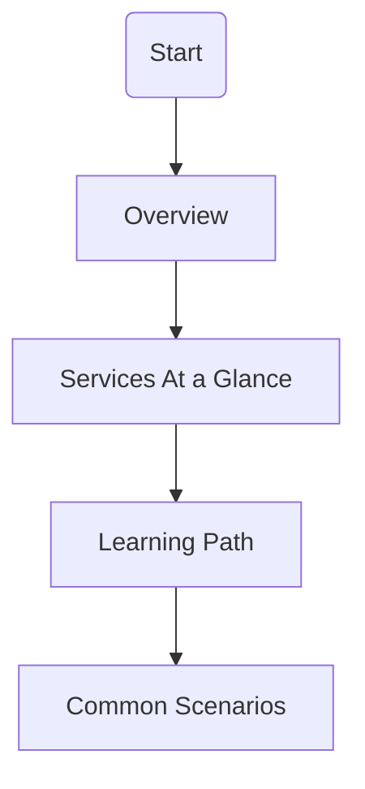

---
content_sources:
  diagrams:
    - id: start-here-index
      type: flowchart
      source: mslearn-adapted
      mslearn_url: https://learn.microsoft.com/en-us/azure/storage/common/storage-introduction
---

# Start Here

Begin your journey into Azure Storage. This section provides the fundamental context needed to understand the more technical sections of the guide.

## Section Contents

| Page | Description |
| ---- | ----------- |
| [Overview](overview.md) | Fundamentals of Azure Storage and its importance |
| [Learning Path](learning-path.md) | Structured routes for different job roles |
| [Services At a Glance](storage-services-at-a-glance.md) | High-level comparison of all storage services |
| [Common Scenarios](common-scenarios.md) | Real-world applications and use cases |

## Reading Path

<!-- diagram-id: start-here-index -->

!!! tip
    Follow the reading path in sequence to build context before moving into implementation-focused platform, operations, and troubleshooting content.

## Quick Orientation

- Start with the Overview to understand the storage account model.
- Use Services At a Glance to compare options before design decisions.
- Read Common Scenarios to map workload patterns to service choices.

## See Also

- [Overview](overview.md)
- [Learning Path](learning-path.md)
- [Storage Services at a Glance](storage-services-at-a-glance.md)

## Sources

- [Azure Storage Overview](https://learn.microsoft.com/en-us/azure/storage/common/storage-introduction)
- [Storage account overview](https://learn.microsoft.com/en-us/azure/storage/common/storage-account-overview)
