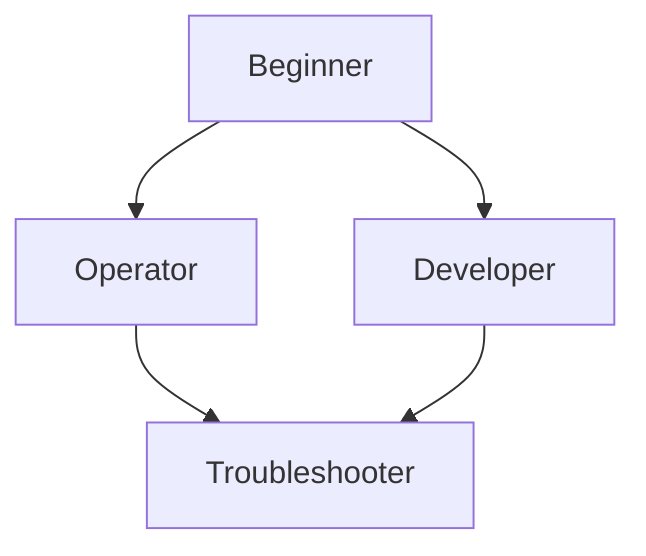

---
content_sources:
  diagrams:
    - id: start-here-learning-path
      type: flowchart
      source: mslearn-adapted
      mslearn_url: https://learn.microsoft.com/en-us/training/browse/?products=azure-storage
---

# Learning Path

This section provides structured reading paths based on your role and objectives when working with Azure Storage.

## Role-Based Paths

| Role | Focus Area |
| ---- | ---------- |
| Beginner | Core services, account types, and basic management |
| App Developer | SDK usage, REST APIs, and connection strings |
| Operator | Redundancy, backup, monitoring, and scaling |
| Troubleshooter | Network security, firewalls, and private endpoints |

## Learning Progression

<!-- diagram-id: start-here-learning-path -->

## Recommended Study

- Review storage account redundancy options (LRS, GRS, ZRS)
- Understand storage access tiers (Hot, Cool, Archive)
- Learn security best practices (SAS tokens, RBAC, Encryption)

!!! note
    If your role spans development and operations, combine the Developer and Operator tracks before moving to troubleshooting topics.

## See Also

- [Overview](overview.md)
- [Platform Fundamentals](../platform/index.md)
- [Best Practices](../best-practices/index.md)

## Sources

- [Azure Storage training](https://learn.microsoft.com/en-us/training/browse/?products=azure-storage)
- [Microsoft Learn: Storage path](https://learn.microsoft.com/en-us/training/paths/store-data-in-azure/)
