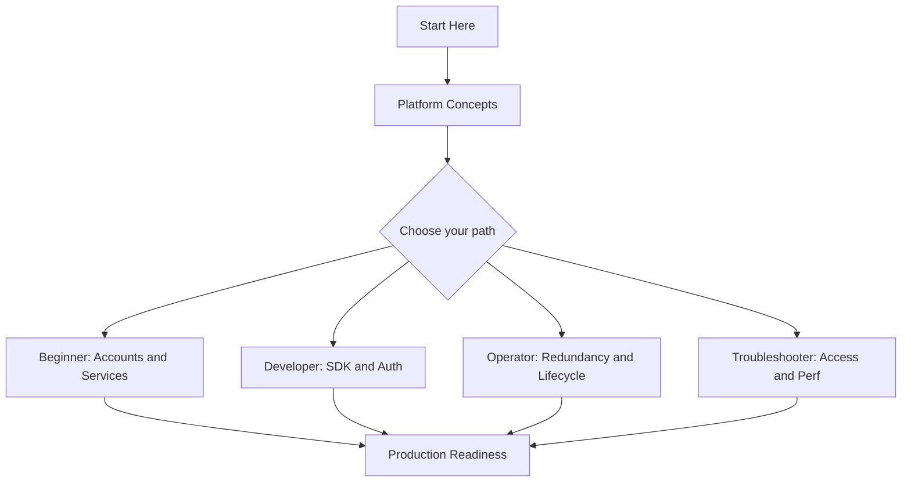
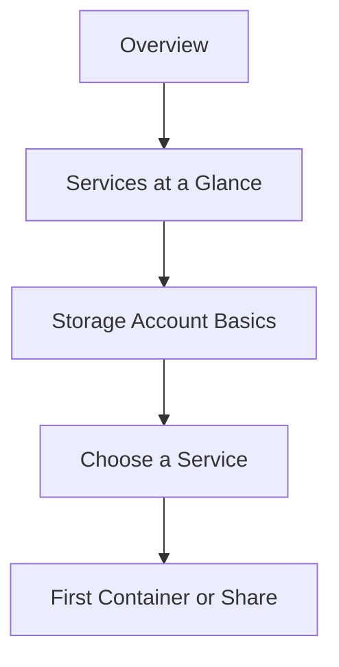
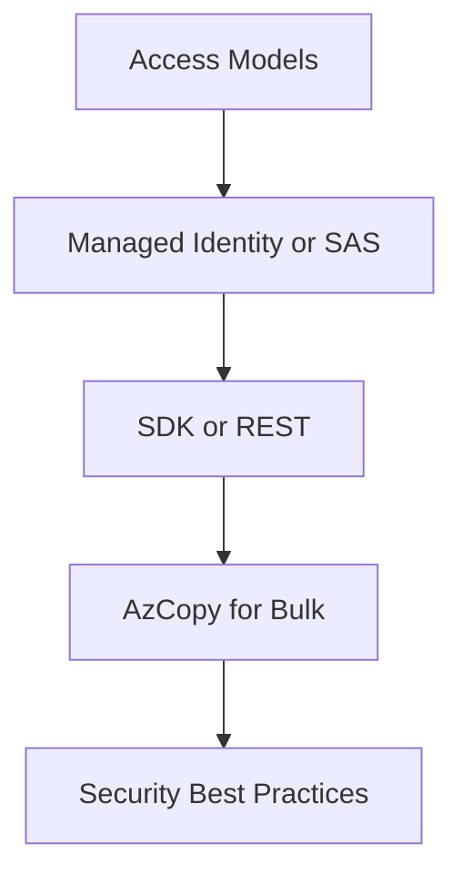
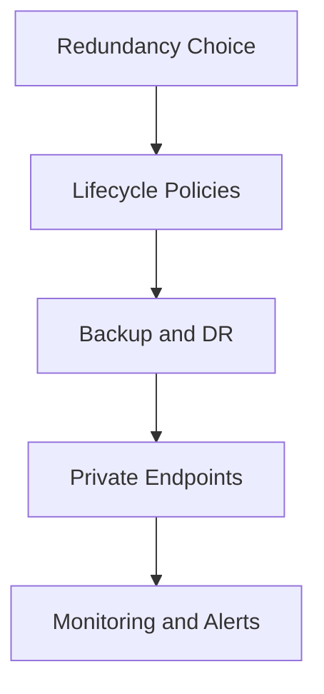
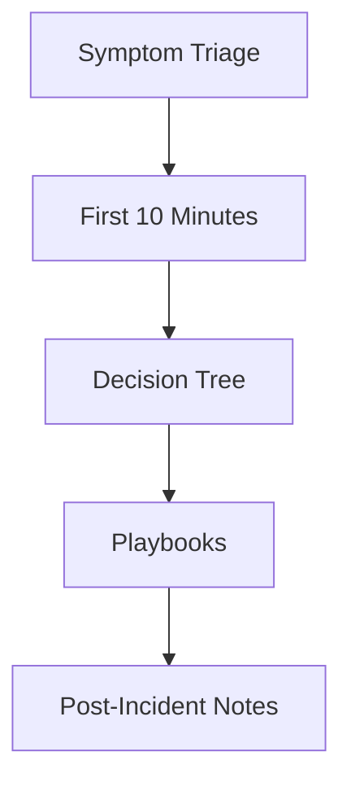

# Learning Paths

Use this page to choose a reading path based on your role and goal. Each path is numbered, so read the pages in order for the best result. Every path ends with a checklist of concrete outcomes you should be able to demonstrate.

!!! tip "Pick one primary path first"
    If you fit multiple roles, pick the one that matches your current goal, complete that path, then read a second path opportunistically. Trying to follow every path in parallel dilutes progress.

## Choose Your Path

| Role | Goal | Time Budget | Start With |
|---|---|---|---|
| **Beginner** | Understand storage accounts, services, and tiers | 1-2 hours | [Overview](overview.md), [Storage Services at a Glance](storage-services-at-a-glance.md) |
| **Developer** | Read and write data from apps using SDK or REST | 2-3 hours | [Platform Hub](../platform/index.md), [Reference Hub](../reference/index.md) |
| **Operator** | Configure redundancy, lifecycle, backup, and monitoring | 3-4 hours | [Scenario Router](scenario-router.md), [Operations Hub](../operations/index.md) |
| **Troubleshooter** | Diagnose access, throttling, and replication issues | 2-4 hours + on-call reference | [Troubleshooting Hub](../troubleshooting/index.md) |

## Recommended Sequence

<!-- diagram-id: storage-learning-paths-overview -->

## Beginner Path

Understand what an Azure Storage account is, how the four services (Blob, File, Queue, Table) differ, and how to create your first container or share.

**Time**: 1-2 hours

<!-- diagram-id: storage-learning-paths-beginner -->

Read in order:

1. [Overview](overview.md)
2. [Storage Services at a Glance](storage-services-at-a-glance.md)
3. [Platform Hub](../platform/index.md) — storage account, blob, file, queue, table basics
4. [Scenario Router](scenario-router.md)
5. [Reference Hub](../reference/index.md) — glossary and service selection guide

### Outcomes

- You can name the four storage services and pick the right one for a use case.
- You can create a storage account with the right redundancy (LRS, GRS, ZRS) for your requirement.
- You can upload a blob and set an access tier (Hot, Cool, Cold, Archive).
- You know where to find the storage service selection guide.

### Microsoft Learn anchors

- [Storage account overview](https://learn.microsoft.com/en-us/azure/storage/common/storage-account-overview)
- [Introduction to Azure Blob Storage](https://learn.microsoft.com/en-us/azure/storage/blobs/storage-blobs-introduction)
- [Create a storage account](https://learn.microsoft.com/en-us/azure/storage/common/storage-account-create)

## Developer Path

Read and write data from applications using the Azure SDK, REST APIs, or AzCopy. Focuses on access models, authentication with managed identity, and SDK ergonomics.

**Time**: 2-3 hours

<!-- diagram-id: storage-learning-paths-developer -->

Read in order:

1. [Platform Hub](../platform/index.md) — focus on access models and authentication
2. [Reference Hub](../reference/index.md) — access methods cheatsheet
3. [Operations Hub](../operations/index.md) — configure access and identity, AzCopy usage
4. [Best Practices Hub](../best-practices/index.md) — security patterns (RBAC, SAS, encryption)
5. [Storage Services at a Glance](storage-services-at-a-glance.md) — pick the right service for the workload

### Outcomes

- You can authenticate to Storage with managed identity from a workload.
- You can generate a user-delegated SAS token with least-privilege scope.
- You can read and write blobs, files, or queues using the Azure SDK.
- You can move bulk data with AzCopy and choose between synchronous and async patterns.

### Microsoft Learn anchors

- [Authorize access to data in Azure Storage](https://learn.microsoft.com/en-us/azure/storage/common/authorize-data-access)
- [Managed identities for Azure resources](https://learn.microsoft.com/en-us/entra/identity/managed-identities-azure-resources/overview)
- [AzCopy overview](https://learn.microsoft.com/en-us/azure/storage/common/storage-use-azcopy-v10)

## Operator Path

Configure and operate storage accounts in production: redundancy, lifecycle policies, backup, private connectivity, and monitoring.

**Time**: 3-4 hours

<!-- diagram-id: storage-learning-paths-operator -->

Read in order:

1. [Scenario Router](scenario-router.md)
2. [Operations Hub](../operations/index.md) — create account, network rules, private endpoints, lifecycle, backup, monitoring
3. [Best Practices Hub](../best-practices/index.md) — redundancy, lifecycle, cost, networking, performance
4. [Platform Hub](../platform/index.md) — redundancy and durability, networking and private access
5. [Reference Hub](../reference/index.md) — redundancy options and networking cheatsheet

### Outcomes

- You can pick between LRS, ZRS, GRS, and GZRS for a workload SLA target.
- You can define a lifecycle policy that tiers blobs from Hot to Cool to Archive.
- You can restrict a storage account to a Private Endpoint and validate DNS.
- You can set up alerts for throttling, availability, and cost anomalies.

### Microsoft Learn anchors

- [Azure Storage redundancy](https://learn.microsoft.com/en-us/azure/storage/common/storage-redundancy)
- [Optimize costs by automating lifecycle](https://learn.microsoft.com/en-us/azure/storage/blobs/lifecycle-management-overview)
- [Monitor Azure Storage](https://learn.microsoft.com/en-us/azure/storage/common/monitor-storage)

## Troubleshooter Path

Diagnose access denied, throttling, replication lag, and lifecycle-policy failures on Azure Storage.

**Time**: 2-4 hours + on-call reference

<!-- diagram-id: storage-learning-paths-troubleshooter -->

Read in order:

1. [Troubleshooting Hub](../troubleshooting/index.md)
2. First 10 Minutes runbooks: [Access](../troubleshooting/first-10-minutes/access.md), [Performance](../troubleshooting/first-10-minutes/performance.md), [Security](../troubleshooting/first-10-minutes/security.md)
3. [Decision Tree](../troubleshooting/decision-tree.md) and [Mental Model](../troubleshooting/mental-model.md)
4. [Playbooks Hub](../troubleshooting/playbooks/index.md) — blob access denied, throttling, replication lag, lifecycle
5. [Reference Hub](../reference/index.md) — access methods and storage networking cheatsheets

### Outcomes

- You can run the First 10 Minutes runbook for an access, performance, or security symptom.
- You can distinguish RBAC failures from SAS failures from Firewall failures.
- You can interpret Storage metrics to prove or refute throttling as a cause.
- You can select the right playbook from a symptom description.

### Microsoft Learn anchors

- [Monitor, diagnose, and troubleshoot Azure Storage](https://learn.microsoft.com/en-us/azure/storage/common/storage-monitoring-diagnosing-troubleshooting)
- [Troubleshoot blob storage authorization](https://learn.microsoft.com/en-us/azure/storage/blobs/authorize-data-operations-portal)
- [Scalability and performance targets for Blob storage](https://learn.microsoft.com/en-us/azure/storage/blobs/scalability-targets)

## Track Selection Matrix

| Situation | Start with | Then continue to |
|---|---|---|
| First storage account in a subscription | Beginner Path | Operator Path |
| Wiring an application to Storage | Developer Path | Operator Path |
| Preparing for launch | Operator Path | Troubleshooter Path |
| Active incidents | Troubleshooter Path | Operator Path (hardening) |

!!! tip "Urgent access failure? Skip the path."
    If a workload is currently failing on 403 or throttled requests, jump directly to [Troubleshooting Hub](../troubleshooting/index.md) and the First 10 Minutes runbooks.

## See Also

- [Overview](overview.md)
- [Storage Services at a Glance](storage-services-at-a-glance.md)
- [Scenario Router](scenario-router.md)
- [Repository Map](repository-map.md)
- [Platform Hub](../platform/index.md)
- [Operations Hub](../operations/index.md)
- [Best Practices Hub](../best-practices/index.md)
- [Troubleshooting Hub](../troubleshooting/index.md)

## Sources

- [Storage account overview](https://learn.microsoft.com/en-us/azure/storage/common/storage-account-overview)
- [Azure Storage redundancy](https://learn.microsoft.com/en-us/azure/storage/common/storage-redundancy)
- [Introduction to Azure Blob Storage](https://learn.microsoft.com/en-us/azure/storage/blobs/storage-blobs-introduction)
- [Authorize access to data in Azure Storage](https://learn.microsoft.com/en-us/azure/storage/common/authorize-data-access)
- [Optimize costs by automating lifecycle](https://learn.microsoft.com/en-us/azure/storage/blobs/lifecycle-management-overview)
- [Monitor, diagnose, and troubleshoot Azure Storage](https://learn.microsoft.com/en-us/azure/storage/common/storage-monitoring-diagnosing-troubleshooting)
