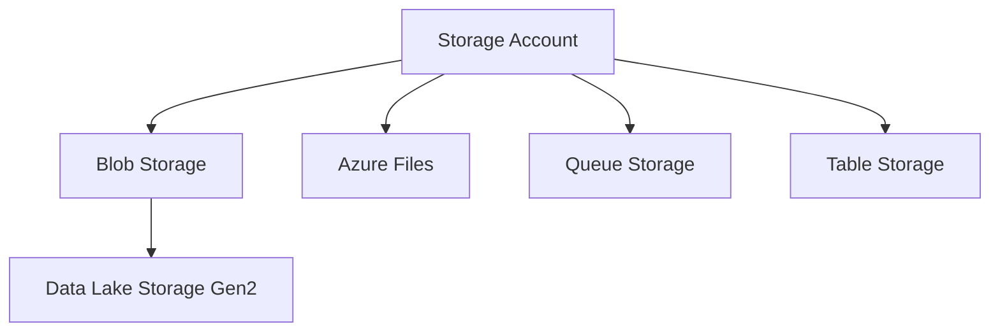

# Overview

Azure Storage is the foundational data service for Microsoft Azure. Most Azure services depend on it for data persistence, application state, and durability.

## Core Storage Services

| Service | Best For |
| ------- | -------- |
| Blob Storage | Unstructured data (objects, images, documents) |
| Azure Files | Fully managed cloud file shares (SMB/NFS) |
| Queue Storage | Asynchronous message queueing |
| Table Storage | NoSQL key-value store |
| Data Lake | Big data analytics (HDFS namespace) |

## Service Hierarchy

!!! note
    The Storage Account is the unique namespace and common foundation for all storage services. Configuration at the account level (redundancy, access tier) impacts all services within it.

## Scope of this Guide

- Included: Cloud-native storage services, data redundancy, security patterns.
- Excluded: Managed disks (covered in VM guide), SQL databases, Cosmos DB.

## See Also

- [How Azure Storage Works](../platform/how-azure-storage-works.md)
- [Common Scenarios](common-scenarios.md)
- [Storage Service Selection Guide](../reference/storage-service-selection-guide.md)

## Sources

- [Introduction to Azure Storage](https://learn.microsoft.com/en-us/azure/storage/common/storage-introduction)
- [About Azure Storage accounts](https://learn.microsoft.com/en-us/azure/storage/common/storage-account-overview)
