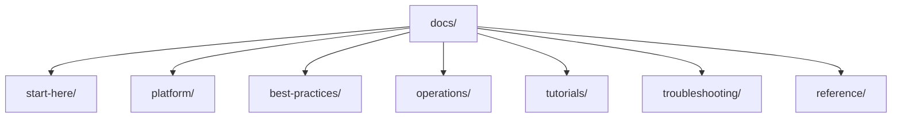

---
content_sources:
  diagrams:
    - id: repository-map
      type: flowchart
      source: self-generated
      justification: "Repository map diagram created for this guide, grounded in Microsoft Learn Azure Storage overview and storage account fundamentals."
      based_on:
        - https://learn.microsoft.com/en-us/azure/storage/common/storage-introduction
        - https://learn.microsoft.com/en-us/azure/storage/common/storage-account-overview
---

# Repository Map

The Azure Storage Practical Guide is organized to mirror the workflow of designing, operating, and troubleshooting Azure Storage — from account creation to data protection and diagnosis. This page explains the structure and purpose of each section so you can jump directly to what you need.

<!-- diagram-id: repository-map -->

## Directory Structure

- `docs/start-here/`
    - `overview.md`: Introduction to Azure Storage and this guide.
    - `learning-paths.md`: Role-based reading paths for beginners, developers, operators, and troubleshooters.
    - `repository-map.md`: This file — a map of major sections and when to use them.
    - `storage-services-at-a-glance.md`: High-level comparison of Blob, Files, Queue, and Table.
    - `scenario-router.md`: Situation-to-destination router across Plan, Deploy, Operate, and Troubleshoot phases.
- `docs/platform/`
    - Core concepts: how Azure Storage works, storage accounts, Blob/File/Queue/Table basics, redundancy and durability, access models, networking, performance and scaling.
- `docs/best-practices/`
    - Production patterns: account design baseline, blob and file share patterns, security, networking, redundancy and DR, performance, cost optimization, lifecycle management, anti-patterns.
- `docs/operations/`
    - Day-2 execution: create storage account, manage containers and shares, configure access/identity, network rules, private endpoints, lifecycle policies, backup and data protection, monitoring, AzCopy data movement.
- `docs/tutorials/`
    - Hands-on lab guides: Blob lifecycle, private endpoints for storage, Azure Files AD integration, storage replication and failover, static websites with CDN.
- `docs/troubleshooting/`
    - Diagnosis-first content: architecture overview, decision tree, evidence map, mental model, quick diagnosis cards, first-10-minutes runbooks, and playbooks for access, performance, and security scenarios.
- `docs/reference/`
    - Quick-lookup material: storage service selection guide, redundancy options, access methods cheatsheet, storage networking cheatsheet, performance terms, glossary, and content validation status.

## When to Use Each Section

| If you want to... | Go to |
|---|---|
| Understand Azure Storage concepts | [Platform](../platform/index.md) |
| Design a production storage architecture | [Best Practices](../best-practices/index.md) |
| Configure storage in production | [Operations](../operations/index.md) |
| Practice with a hands-on lab | [Tutorials](../tutorials/index.md) |
| Diagnose a live incident | [Troubleshooting](../troubleshooting/index.md) |
| Look up a decision or command | [Reference](../reference/index.md) |

## See Also

- [Overview](overview.md)
- [Learning Paths](learning-paths.md)
- [Storage Services at a Glance](storage-services-at-a-glance.md)
- [Scenario Router](scenario-router.md)

## Sources

- [Azure Storage Overview](https://learn.microsoft.com/en-us/azure/storage/common/storage-introduction)
- [Storage account overview](https://learn.microsoft.com/en-us/azure/storage/common/storage-account-overview)
