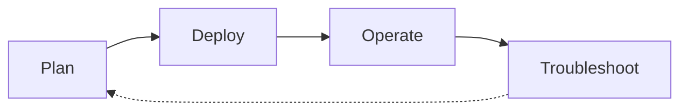

# Scenario Router

Use this page when you have a specific situation and want to jump straight to the page that answers it. This is a breadth-first index across four lifecycle phases — Plan, Deploy, Operate, Troubleshoot — that complements the depth-first [Learning Paths](learning-paths.md) and the symptom-first [Decision Tree](../troubleshooting/decision-tree.md).

!!! tip "Start with Learning Paths if you're new to Azure Storage"
    This page assumes you already know what you're trying to do. If you're still deciding what to learn first, start with [Learning Paths](learning-paths.md) — it sequences a role-based tour of the guide. Use this Scenario Router when you have a specific question and want to jump to the exact page that answers it.

## How to Use This Router

- Pick the table for the lifecycle phase you're in — Plan, Deploy, Operate, or Troubleshoot.
- Scan the left column for the situation that matches yours; open the destination on the right.
- If two rows fit, prefer the row from the phase you're actually in — the same platform concept often appears in more than one phase.
- If your situation spans two phases (a design choice today that will become an incident later), check [Cross-Phase Scenarios](#cross-phase-scenarios) first.
- Every destination is a real page in this guide, not an external link and not an aspirational page.
- Rows are intentionally short. Follow the link for the depth; this table is a switchboard, not a summary.
- If your situation is missing, [open an issue](https://github.com/yeongseon/azure-storage-practical-guide/issues) — the router is meant to grow.

## Lifecycle Overview

<!-- diagram-id: storage-scenario-router-lifecycle -->

## I'm Planning

| Situation | Where to go |
|---|---|
| I'm choosing which learning path to follow | [Learning Paths](learning-paths.md) — role-based reading paths |
| I want to understand how Azure Storage works end-to-end | [How Azure Storage Works](../platform/how-azure-storage-works.md) — service model and data plane |
| I'm choosing between Blob, File, Queue, and Table | [Storage Services at a Glance](storage-services-at-a-glance.md) — service-selection cheat sheet |
| I'm sizing a storage account and picking a tier | [Storage Account Basics](../platform/storage-account-basics.md) — SKUs, kinds, and access tiers |
| I'm choosing redundancy (LRS, ZRS, GRS, RA-GRS, GZRS) | [Redundancy and Durability](../platform/redundancy-and-durability.md) — durability targets and failure modes |
| I'm planning access model (keys, SAS, RBAC, or AAD) | [Access Models](../platform/access-models.md) — auth choices and blast radius |
| I'm planning private connectivity for a storage account | [Networking and Private Access](../platform/networking-and-private-access.md) — service endpoints and private endpoints |
| I'm designing the storage baseline for a new landing zone | [Storage Account Design Baseline](../best-practices/storage-account-design-baseline.md) — segmentation and account boundaries |
| I want to plan storage cost before I deploy | [Cost Optimization](../best-practices/cost-optimization-best-practices.md) — tiering, egress, and lifecycle |

## I'm Deploying

| Situation | Where to go |
|---|---|
| I need to create the initial storage account | [Create Storage Account](../operations/create-storage-account.md) — provisioning and defaults |
| I'm wiring access and identity (RBAC, keys, SAS) | [Configure Access and Identity](../operations/configure-access-and-identity.md) — auth setup and rotation prep |
| I need to configure network rules and firewall | [Configure Network Rules](../operations/configure-network-rules.md) — service endpoint and firewall wiring |
| I need to attach a private endpoint | [Use Private Endpoints](../operations/use-private-endpoints.md) — PE, NIC, and DNS wiring |
| I'm creating containers and file shares for the workload | [Manage Containers and Shares](../operations/manage-containers-and-shares.md) — data-plane provisioning |
| I need to move data in with AzCopy or SDK | [AzCopy and Data Movement](../operations/azcopy-and-data-movement.md) — bulk ingest patterns |

## I'm Operating in Production

| Situation | Where to go |
|---|---|
| I need day-2 storage operational procedures | [Operations Hub](../operations/index.md) — production runbooks |
| I want to follow production storage best practices | [Best Practices Hub](../best-practices/index.md) — hardening and design guidance |
| I'm configuring lifecycle policies for tiering and deletion | [Manage Lifecycle Policies](../operations/manage-lifecycle-policies.md) — rule definition and validation |
| I'm setting up monitoring, metrics, and alerts | [Monitoring and Alerting](../operations/monitoring-and-alerting.md) — baseline instrumentation |
| I'm configuring backup and data protection | [Backup and Data Protection](../operations/backup-and-data-protection.md) — soft delete, versioning, and Backup Vault |
| I'm hardening security posture for storage | [Security Best Practices](../best-practices/security-best-practices.md) — keys, SAS, encryption, and identity |
| I'm hardening performance for high-throughput workloads | [Performance Best Practices](../best-practices/performance-best-practices.md) — partitioning and concurrency |
| I'm designing lifecycle rules for cost | [Lifecycle Management Best Practices](../best-practices/lifecycle-management-best-practices.md) — rule design and audit |
| I'm operating file shares with SMB/NFS in production | [File Share Best Practices](../best-practices/file-share-best-practices.md) — protocol, quota, and identity |

## I'm Troubleshooting

| Situation | Where to go |
|---|---|
| I need to systematically diagnose a storage issue | [Decision Tree](../troubleshooting/decision-tree.md) — hypothesis-driven triage flow |
| I need to know what evidence to collect | [Evidence Map](../troubleshooting/evidence-map.md) — question → CLI + diagnostic artifact index |
| I want quick pattern-match cards for common symptoms | [Quick Diagnosis Cards](../troubleshooting/quick-diagnosis-cards.md) — one-page symptom cards |
| An incident just started and I have 10 minutes | [First 10 Minutes](../troubleshooting/first-10-minutes/index.md) — ordered triage checklist |
| I need the mental model for how storage requests fail | [Mental Model](../troubleshooting/mental-model.md) — auth, network, and service layers |
| I cannot access the storage account at all | [Cannot Access Storage Account](../troubleshooting/playbooks/access/cannot-access-storage-account.md) — network and auth paths |
| I'm getting 403 on blob operations | [Blob Access Denied](../troubleshooting/playbooks/blob-access-denied.md) — RBAC, SAS, and firewall causes |
| I'm being throttled with 503 or 500 responses | [Storage Throttling](../troubleshooting/playbooks/storage-throttling.md) — IOPS, partition, and account-scope limits |
| My private endpoint isn't resolving or is unreachable | [Private Endpoint and DNS Issues](../troubleshooting/playbooks/access/private-endpoint-and-dns-issues.md) — DNS zone and NIC checks |
| My lifecycle policy isn't tiering or deleting blobs | [Lifecycle Policy Not Working](../troubleshooting/playbooks/lifecycle-policy-not-working.md) — filter, run-time, and match conditions |

## Cross-Phase Scenarios

Some situations straddle two phases — the design choice you make while planning determines the failure mode you eventually debug. These rows link the two together so you can see the pattern *and* the drill in one place. If you're only in one phase today, still skim this table: it's the cheapest way to preview which decisions will hurt later.

| Situation | Where to go |
|---|---|
| I'm choosing redundancy and want to see what a region failover looks like | [Redundancy and DR Best Practices](../best-practices/redundancy-and-dr-best-practices.md) then [Replication Lag Issues](../troubleshooting/playbooks/replication-lag-issues.md) — pattern + incident |
| I'm setting up private endpoints and want to see the DNS failure mode | [Networking Best Practices](../best-practices/networking-best-practices.md) then [Private Endpoint and DNS Issues](../troubleshooting/playbooks/access/private-endpoint-and-dns-issues.md) — design + drill |
| I'm tuning for high throughput and want to see how throttling appears | [Performance Best Practices](../best-practices/performance-best-practices.md) then [Throttling and Performance Issues](../troubleshooting/playbooks/performance/throttling-and-performance-issues.md) — pattern + incident |
| I'm setting up SAS and want to see how token issues surface | [Security Best Practices](../best-practices/security-best-practices.md) then [SAS and Token Issues](../troubleshooting/playbooks/security/sas-and-token-issues.md) — plan + operate |

## When This Router Isn't the Right Entry Point

- You're brand new to Azure Storage → start with [Learning Paths](learning-paths.md) instead.
- You already have a symptom (403, throttling, DNS resolution failure) and don't know which lifecycle phase you're in → jump to [Decision Tree](../troubleshooting/decision-tree.md) or [Quick Diagnosis Cards](../troubleshooting/quick-diagnosis-cards.md).
- You're comparing Blob vs File vs Queue vs Table for a workload → use [Storage Services at a Glance](storage-services-at-a-glance.md).

## See Also

- [Learning Paths](learning-paths.md) — depth-first, role-based reading order
- [Overview](overview.md) — what Azure Storage is and who this guide is for
- [Repository Map](repository-map.md) — full section map
- [Storage Services at a Glance](storage-services-at-a-glance.md) — service selection cheat sheet
- [Decision Tree](../troubleshooting/decision-tree.md) — symptom-first troubleshooting router
- [Evidence Map](../troubleshooting/evidence-map.md) — evidence-collection index
