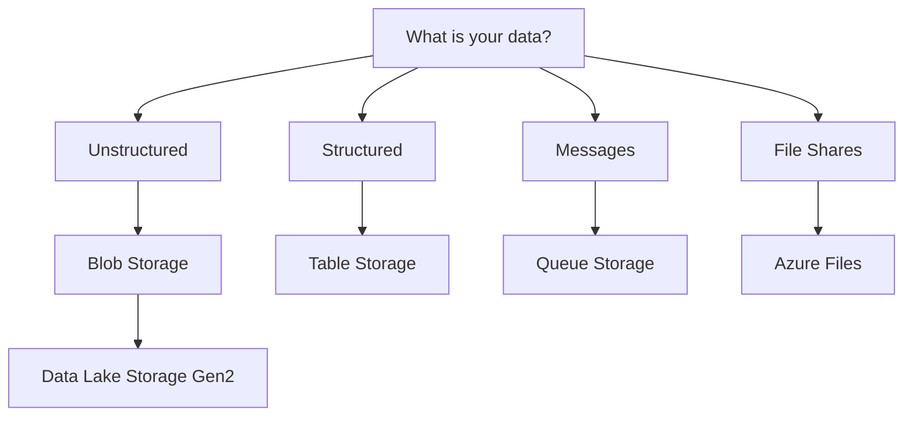

# Storage Services at a Glance

Azure Storage provides several services tailored to specific data types and access requirements. Selecting the right service is critical for performance and cost optimization.

## Service Comparison

| Service | Data Type | Protocol | Use Case |
| ------- | --------- | -------- | -------- |
| Blob | Unstructured | REST/HDFS | Images, documents, streaming |
| Files | File Shares | SMB/NFS | Lift-and-shift, app config |
| Queue | Messages | REST | Decoupling services, task lists |
| Table | NoSQL | REST | Structured data, key-value |
| Data Lake | Hierarchical | HDFS | Big data, analytics |

## Service Selection Decision

!!! note
    Choosing the right service ensures optimal latency and throughput. For instance, use Queue Storage for high-volume asynchronous messaging rather than using a database table.

## Selection Reminders

- Match service choice to access pattern first, then optimize cost.
- Validate protocol requirements (REST, SMB, NFS, HDFS) early.
- Confirm lifecycle and retention requirements before deployment.

## See Also

- [Blob Storage Basics](../platform/blob-storage-basics.md)
- [File Storage Basics](../platform/file-storage-basics.md)
- [Queue and Table Basics](../platform/queue-and-table-basics.md)

## Sources

- [Decide when to use Azure Blobs, Azure Files, or Azure Disks](https://learn.microsoft.com/en-us/azure/storage/common/storage-decide-blobs-files-disks)
- [Azure Storage services overview](https://learn.microsoft.com/en-us/azure/storage/common/storage-introduction#core-storage-services)
