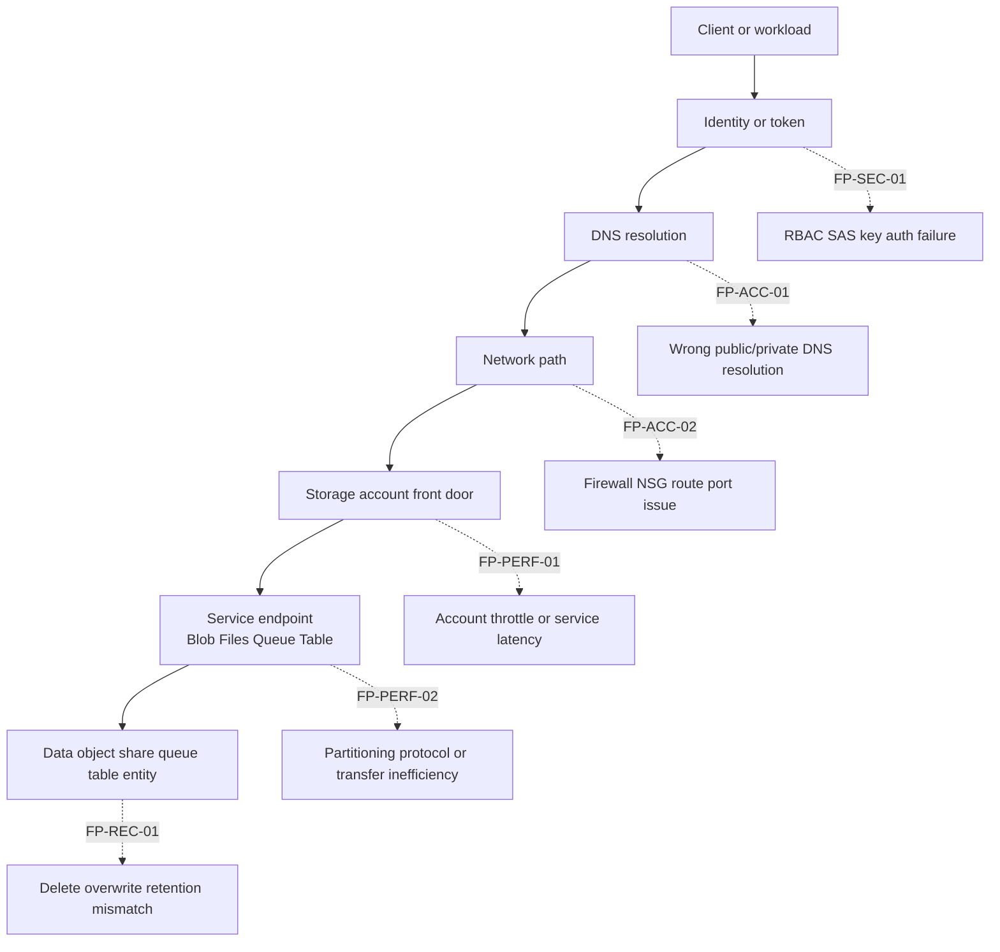
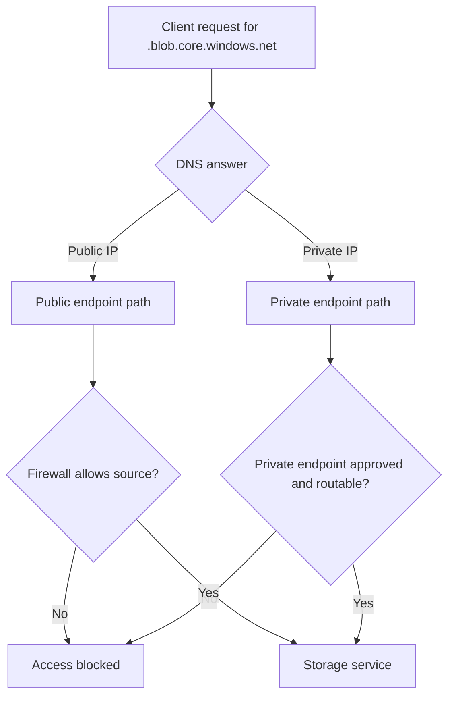

---
content_sources:
  diagrams:
    - id: troubleshooting-architecture-overview
      type: flowchart
      source: mslearn-adapted
      mslearn_url: https://learn.microsoft.com/en-us/azure/storage/common/storage-network-security
    - id: troubleshooting-architecture-overview-2
      type: flowchart
      source: mslearn-adapted
      mslearn_url: https://learn.microsoft.com/en-us/azure/storage/common/storage-private-endpoints
---

# Troubleshooting Architecture Overview

This page answers the first question in a storage incident: **where in the storage path can this fail?** Use it to classify the problem before opening a detailed playbook.

## Storage failure path

<!-- diagram-id: troubleshooting-architecture-overview -->

## Failure domains and first checks

| Failure Point | Typical Symptom | First Evidence | Primary Playbook |
|---|---|---|---|
| FP-SEC-01 Identity and authorization | 403, auth mismatch, token rejected | error code, token/SAS fields, RBAC scope | [Authorization Failures](playbooks/security/authorization-failures.md) |
| FP-ACC-01 DNS and name resolution | public IP instead of private IP, name lookup failure | `nslookup`, zone link state, endpoint FQDN | [Private Endpoint and DNS Issues](playbooks/access/private-endpoint-and-dns-issues.md) |
| FP-ACC-02 Connectivity path | timeout, cannot mount, cannot reach account | storage firewall, port test, private endpoint approval | [Cannot Access Storage Account](playbooks/access/cannot-access-storage-account.md) |
| FP-PERF-01 Account/service saturation | 429, 503, latency spike | transaction metrics, success rate, server latency | [Throttling and Performance Issues](playbooks/performance/throttling-and-performance-issues.md) |
| FP-PERF-02 Transfer design inefficiency | slow upload/download, many small-file delays | concurrency settings, RTT, object size mix | [Slow Upload / Download](playbooks/performance/slow-upload-download.md) |
| FP-REC-01 Protection and recovery gap | deleted or overwritten data cannot be restored | retention state, versioning, soft delete, backup | [Data Protection and Recovery Issues](playbooks/performance/data-protection-and-recovery-issues.md) |

## Public and private access model

<!-- diagram-id: troubleshooting-architecture-overview-2 -->

The most common misclassification is treating a DNS or routing problem as an authorization problem. If the request is hitting the wrong endpoint path, the auth evidence is often misleading.

## Evidence layers to collect in order

1. **Symptom evidence**: exact error code, timestamp, protocol, target endpoint.
2. **Path evidence**: DNS answer, firewall state, private endpoint state, required port reachability.
3. **Identity evidence**: RBAC role, SAS fields, account key policy, token audience and expiry.
4. **Performance evidence**: server latency, end-to-end latency, transaction spikes, concurrency level.
5. **Recovery evidence**: retention settings that were enabled before the incident.

## Quick routing examples

- 403 with a valid-looking SAS often still needs a [security playbook](playbooks/security/sas-and-token-issues.md) first.
- Private endpoint configured but traffic resolves to public IP usually belongs in [access playbooks](playbooks/access/private-endpoint-and-dns-issues.md).
- Slow transfers with no 429/503 often belong in [transfer-performance playbooks](playbooks/performance/slow-upload-download.md), not throttling.
- Missing data after deletion belongs in the [recovery playbook](playbooks/performance/data-protection-and-recovery-issues.md), and the key question is whether protection existed before impact.

## See Also

- [Decision Tree](decision-tree.md)
- [Evidence Map](evidence-map.md)
- [Mental Model](mental-model.md)
- [First 10 Minutes](first-10-minutes/index.md)
- [Playbooks](playbooks/index.md)

## Sources

- [Azure Storage firewall rules](https://learn.microsoft.com/en-us/azure/storage/common/storage-network-security)
- [Use private endpoints for Azure Storage](https://learn.microsoft.com/en-us/azure/storage/common/storage-private-endpoints)
- [Authorize access to data in Azure Storage](https://learn.microsoft.com/en-us/azure/storage/common/authorize-data-access)
- [Scalability and performance targets for standard storage accounts](https://learn.microsoft.com/en-us/azure/storage/common/scalability-targets-standard-account)
