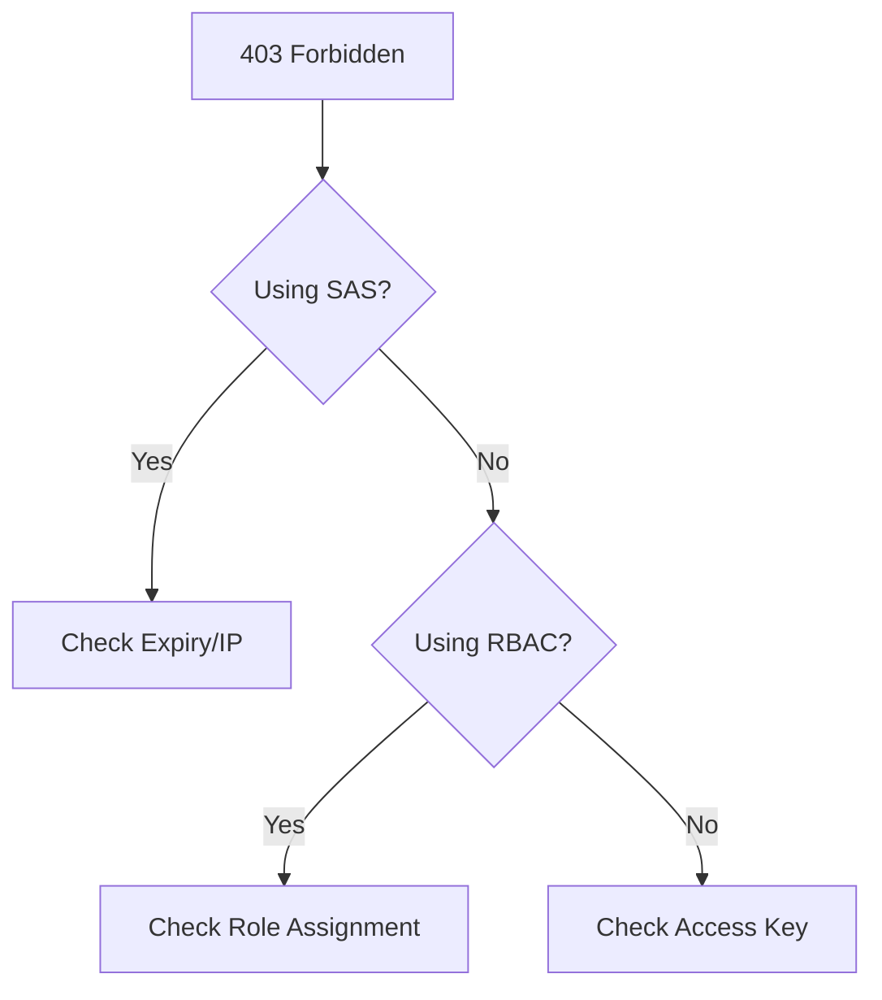

# Authorization Failures

Resolve 403 Forbidden and other authorization errors.

| Cause | Diagnosis | Resolution |
|-------|-----------|------------|
| RBAC Scope | `Get-AzRoleAssignment` | Assign role at account/container. |
| SAS Expired | Check `se` parameter in URL | Regenerate SAS token. |
| Key Disabled | Account setting: `Allow shared key` | Enable key or use Azure AD. |
| IP Restriction | Check storage firewall | Add client IP to whitelist. |

!!! note
    Distinguish between data plane permissions (e.g., Blob Data Reader) and control plane permissions (e.g., Contributor).

## Authorization Triage Checklist

- Capture exact error details from response headers.
- Confirm token tenant, audience, and expiry values.
- Confirm role assignment scope includes target resource.
- Confirm SAS permissions and allowed services are correct.
- Confirm account setting for shared key aligns with auth method.
- Confirm network rules are not masking as auth failures.

## See Also

- [Access Models](../platform/access-models.md)
- [Configure Access and Identity](../operations/configure-access-and-identity.md)
- [SAS and Token Issues](sas-and-token-issues.md)

## Sources
- [Troubleshoot storage client application errors](https://learn.microsoft.com/en-us/troubleshoot/azure/azure-storage/blobs/alerts/troubleshoot-storage-client-application-errors)
- [Debug RBAC errors](https://learn.microsoft.com/en-us/azure/role-based-access-control/troubleshooting)
